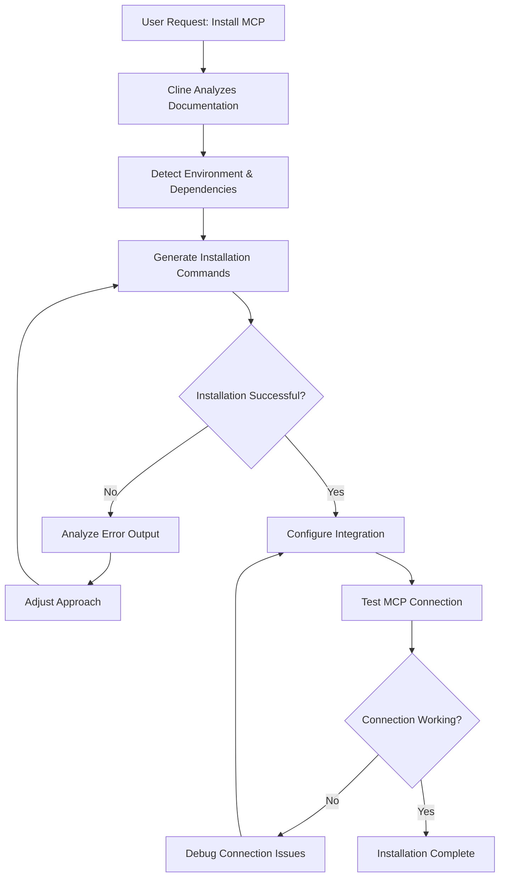

AI agents like Cline can now install complex software by interpreting documentation and handling environment differences automatically. Is this the future of software installation, or are we creating new problems by delegating these tasks to AI?

I'm a bit late to the Model Context Protocol (MCP) party. While everyone was enthusiastically exploring the capabilities of MCP months ago, I only recently started diving into this ecosystem. My first experience was with the Logseq MCP, which provides some basic but useful functionality for the note-taking app. Then I tried the Brave Search MCP, which allows AI assistants to perform web searches directly.

What struck me wasn't just the functionality these MCPs provided, but rather the installation process. As a developer who's set up numerous environments and tools over the years, I found myself watching with fascination as Cline, the AI assistant as a VS Code Plugin, took over what would typically be a manual, error-prone process.

<!--more-->

## What Are MCP Marketplace in Cline?

Before I dive deeper, let me briefly explain what MCPs are for those who might not be familiar. The Model Context Protocol (MCP) is a protocol that enables large language models (LLMs) like Claude or GPT to interact with external tools and services. MCP servers extend AI capabilities by allowing them to access specialized functions - from searching the web to controlling smart home devices.

MCP marketplace in Cline are where developers can discover, distribute, and install these extensions. Think of them as app stores specifically for AI assistants. As these ecosystems grow, they're becoming increasingly important for developers who want to enhance their AI tools with specialized capabilities.

## The Traditional Pain of Installing Complex Software

Installing complex software traditionally requires several manual steps. First, you need to download the source code or package. Then you need to install all dependencies, which could be Node.js packages for JavaScript-based applications, Python packages, or dependencies in other languages. Next, you might need to build the project (transpiling TypeScript to JavaScript, for example) before finally configuring and running the software.

This process is tedious and error-prone. Miss a dependency or misconfigure a setting, and you'll find yourself digging through cryptic error messages. The complexity multiplies when dealing with software written in different languages, each with its own ecosystem of dependencies and build tools.

Consider a typical Node.js/TypeScript project. You need:
1. The correct Node.js version
2. TypeScript installed globally or locally
3. All npm dependencies installed
4. The TypeScript code compiled to JavaScript
5. Proper configuration to run the application

The same goes for Python-based applications, which might require specific Python versions, virtual environments, and packages. What makes this particularly challenging is that each user's environment is different. One person might have Node.js installed via nvm, another through a system package manager, and yet another might not have it installed at all.

This reminds me of my first internship, where I was tasked with building Windows installation wizards for enterprise software. I spent weeks crafting these pixel-perfect GUI installers with "Next" buttons, progress bars, and checkboxes for optional components. We had to anticipate every possible environment configuration and handle each possible branch. The most challenging part was handling failed installations gracefully - displaying helpful error messages instead of cryptic error codes when something inevitably went wrong.

## Cline's Agentic Approach to Installation

This is where Cline's agentic approach to software installation becomes compelling. Instead of following a rigid script, Cline acts as an AI agent that dynamically adapts to your specific environment. Let me walk you through how it works.

When you ask Cline to install an MCP server, it first analyzes the available documentation. Unlike a human who might skim through instructions or a traditional script that expects a standardized environment, Cline interprets the documentation thoroughly and creates a mental model of what needs to be done.

Next, Cline executes the necessary commands to set up the MCP. It creates directories, writes configuration files, installs dependencies, and runs build commands - all dynamically generated based on its understanding of your environment and the MCP's requirements.

In my case, I ran into an interesting limitation. I use nvm (Node Version Manager) to manage my Node.js installations, which means the global `npx` command wasn't in the standard PATH that Cline could access. While Cline successfully set up most of the MCP server, I had to manually adjust the configuration to point to the correct Node.js installation path.

This approach isn't limited to MCP servers either. The same pattern could be applied to installing any software with complex dependencies - from development frameworks to specialized tools with intricate setup processes.

## The Benefits of Agentic Installation

The agentic approach to software installation offers several compelling benefits that address long-standing challenges in software deployment.

First, there's the flexibility and adaptability. Unlike rigid installation scripts, an AI agent can handle unexpected situations. If a command fails or a dependency is missing, it can diagnose the problem and attempt alternative solutions. This closely resembles how a human developer would approach troubleshooting, but without requiring constant human attention.

Another significant advantage is the reduced need for pre-written installation scripts. Developers don't need to create and maintain complex installation scripts for every possible environment. Instead, the AI agent interprets documentation and creates installation steps dynamically, saving valuable development time.

Perhaps most impressively, agentic installation handles environment differences automatically. This includes detecting and installing missing dependencies that traditional package managers might not cover. While npm can install JavaScript packages and pip can handle Python modules, they typically don't manage "universal" dependencies like the Node.js runtime itself, Python interpreter, or system libraries. An AI agent can identify these gaps and fill them appropriately.

This capability extends to adapting to different operating systems as well. Whether dealing with different file system structures, case sensitivity rules, or configuration file locations, the AI agent can adjust its approach based on the detected environment.

The result is a more flexible approach across platforms, reducing compatibility issues that have plagued software installation for decades. The AI's approach to error handling is also notable - it can recognize common error patterns, suggest solutions, and apply fixes without requiring the user to understand complex technical details.

## The Drawbacks and Risks

Despite its advantages, the agentic approach to software installation isn't without significant drawbacks and risks.

When working with complex dependencies across Node.js, TypeScript, and Python, the installation process can involve extensive trial and error. The AI might need multiple attempts to resolve dependency conflicts or configuration issues, potentially consuming substantial computational resources and time. In some cases, this can lead to higher costs as LLM usage adds up, or you might even run out of your quota before installation completes.

Even after the AI agent's best efforts, many installations still require manual adjustments. As I experienced with my nvm-based Node.js setup, there are environmental peculiarities that the AI might not be able to detect or address correctly.

There's also a concerning lack of control over where software gets installed. While experienced developers might specify installation directories, less experienced users or "vibe-coders" (those who code by feel rather than deep understanding) may simply accept whatever the AI suggests. This can lead to software being scattered across unexpected locations in the file system, making it difficult to manage or uninstall later.

Security concerns arise when default settings are used without scrutiny. AI agents might configure software with suboptimal security settings or outdated configurations if they're following general documentation. Even more concerning is the potential for exposing sensitive information. If an AI agent needs API keys or other credentials during installation, how these are stored and managed becomes a critical security consideration.

A particularly worrying security risk involves credential exposure through chat history. During installation, the AI agent might ask you for API keys, access tokens, or other sensitive credentials. If your LLM provider stores your conversation history, these credentials could potentially be exposed to third parties or accessed later in contexts you didn't anticipate. Unlike when you manually configure software and can directly control where your credentials are stored, with agentic installation your sensitive information might be inadvertently preserved in conversation logs that exist outside your control.

Another issue is the inconsistency of installation results. LLMs make different choices each time they run, creating a butterfly effect of small decisions (package manager selection, installation locations, file naming) that can lead to significantly different outcomes across installations.

Finally, the quality of installation depends heavily on the system prompts guiding the AI. Without disciplined prompt engineering, the AI might make assumptions or take shortcuts that create fragile or problematic installations.

## Potential Solutions and Improvements

To address these challenges, several improvements could make agentic software installation more reliable and secure.

A system-wide preference setting for installations would allow users to specify their preferred installation paths, dependency versions, and security configurations. The AI agent could then respect these preferences across all installations, ensuring consistency and adherence to personal or organizational policies.

Clear prompts are essential for guiding the AI agent effectively. Developing standardized prompting templates for software installation could reduce ambiguity and improve outcomes. Perhaps we could even create an MCP server specifically designed to provide installation guidance and remember user preferences.

For mission-critical components, developer-curated installation scripts remain valuable. These hand-crafted scripts can incorporate security best practices and handle edge cases that an AI might miss. The AI agent could then use these scripts as a starting point, only deviating when necessary to adapt to specific environments.

Containerization offers another promising solution. Using Docker or Podman to create isolated environments for each installation would provide consistency and security while minimizing conflicts between different software components. You can see that in my chat history, the AI opted for `npx` over containers because it think it's simplier. Maybe a prompt that force it to use container might work better. 

Looking to the future, Rust with its Cargo package manager offers advantages for MCP development. Rust's ability to compile to native binaries eliminates many runtime dependency issues, potentially making installation more straightforward and reliable. I have seen some MCP libraries poping up on Crates.io and I'm planning to explore it further. 

For the most comprehensive solution to dependency management, Nix deserves mention. Its declarative approach to package management ensures reproducible builds and consistent environments, which could complement an AI agent's installation capabilities. Nix is notorious for having a steep learning curve. If AI can use it we might be able to combine the power of Nix and ease-of-use of a natural languagechatbot. 

## Finding the Balance

Agentic software installation with tools like Cline represents a fascinating evolution in how we deploy software. It offers compelling benefits in terms of adaptability, reduced manual effort, and handling environmental differences. However, it also introduces new challenges around control, security, and consistency.

As developers, we need to find the right balance - leveraging the capabilities of AI agents while maintaining appropriate oversight. The most effective approach likely combines the flexibility of AI-driven installation with the reliability of developer-curated installation patterns.

If you're experimenting with agentic installation in your workflow, I recommend starting with non-critical tools and maintaining careful oversight of the installation process. Establish clear preferences and provide specific guidance to the AI agent. And whenever possible, use containerization to isolate installations and reduce the risk of system-wide conflicts.

The future of software installation might not be fully automated by AI agents, but they're certainly becoming valuable assistants in the process - capable of handling the tedious details while we focus on the aspects that truly require human judgment.
