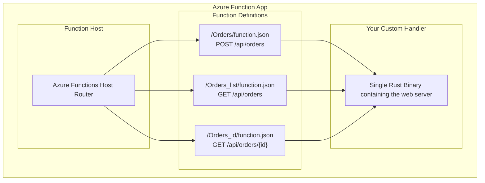

In my [previous post]({{site.url}}/blog/2025/07/26/serverless-rust-on-azure-deploying-a-rust-azure-function.html), we deployed a simple "Hello World" Rust function to Azure. Now we're ready to build something production-worthy: a database-backed REST API that handles real business logic. We'll create a cake ordering system for a local bakery, complete with data persistence, input validation, and proper error handling.


<!--more-->

## The Business Case: Sweet API Solutions

Before diving into code, let's establish what we're building. Our fictional bakery needs a digital ordering system where:

- Bakery staff can create custom cake orders taken from counter or phone customers
- Each order tracks customer information, custom text to be printed on the cake, and cake style selections
- Staff can view and manage all orders for fulfillment tracking
- Orders persist in a database for inventory management and operational workflows


Note: We're not implementing user authentication or authorization in this tutorial - that's a topic for future posts. This API is designed for internal bakery operations.


This scenario showcases real-world serverless patterns: event-driven APIs, NoSQL data modeling, input validation, and stateless request handling. It's complex enough to demonstrate production considerations while remaining approachable for learning.

You can find the complete code on GitHub: [https://github.com/shinglyu/serverless-rust-on-azure/tree/api-with-db](https://github.com/shinglyu/serverless-rust-on-azure/tree/api-with-db).

## API Design

Before building the implementation, let's design our API endpoints and data schema. Our cake ordering system needs three core operations:

**API Endpoints:**

- `POST /api/orders` - Create a new cake order
- `GET /api/orders` - List all orders (for staff to see pending work)
- `GET /api/orders/{id}` - Get a specific order by ID

**Data Schema Rationale:**

Each order contains:
- **Order ID**: UUID for unique identification across the system
- **Customer ID**: UUID to track repeat customers and link orders
- **Custom Text**: The message to be printed on the cake (limited to 50 ASCII characters for printing constraints)
- **Cake Style**: Predefined options to ensure bakery can fulfill (vanilla-flowers, chocolate-hearts, etc.)
- **Status**: Workflow tracking (pending, in-progress, ready, completed)
- **Created At**: When the order was placed (for tracking and fulfillment scheduling)
- **Pickup Date**: When the customer wants to collect the cake

## Understanding Azure Functions for Multi-Endpoint APIs

In the previous post, there was only one API endpoint, but for this use case, we need multiple API endpoints. Before we start coding, let's understand how Azure Functions differs from AWS Lambda in handling multi-endpoint APIs.

### The One-Binary, Multiple-Functions Model

Unlike AWS Lambda where each function is typically a separate deployment unit, Azure Functions with custom handlers works differently.

In our dedicated App Service Plan, there's one Azure Functions Host running on each underlying VM instance. This host communicates with your single custom handler (web server). You can reference the [official Microsoft documentation on custom handlers](https://learn.microsoft.com/en-us/azure/azure-functions/functions-custom-handlers) for detailed architecture diagrams.

Conceptually, you can think of this as:


Notice a few things here:

1. **Shared Code Base**: All your functions' code are in the same binary, and they run as one Warp web server. 
2. **No Function Isolation**: Unlike Lambda's separate execution contexts, your functions share memory and state within the same process.
3. **Configuration-Based Routing**: `function.json` files define HTTP routes and triggers, but your Rust code handles the actual request processing.

This means the "Function" in an Azure Function App are more of a logical construct that has a route and trigger configuration, but not actually separate deployment units. Your custom handler is just a normal web server with multiple routes. So the common web server best practices like using share database connection, extract shared code (e.g. validation, payload formatting) into reusable modules applys here.

### Function Configuration Setup

Before we start implementing our multi-endpoint API, we need to set up the function definitions that Azure Functions will use to route requests to our custom handler. Unlike single-endpoint functions, multi-endpoint APIs require careful configuration to handle different routes properly.

Each endpoint requires its own function definition. Create the following folder structure:

```
Orders/
  function.json
Orders_list/
  function.json  
Orders_id/
  function.json
```

**Route Customization**: By default, Azure Functions would create routes like `/api/Orders` (matching the folder name), but you can customize these using the `route` parameter in `function.json`.

Example `Orders/function.json` for the POST endpoint:

```json
{
  "bindings": [
    {
      "authLevel": "anonymous",
      "type": "httpTrigger",
      "direction": "in",
      "name": "req",
      "methods": ["post"],
      "route": "orders"
    },
    {
      "type": "http",
      "direction": "out",
      "name": "res"
    }
  ]
}
```

For the nested path endpoint, create `Orders_id/function.json`:

```json
{
  "bindings": [
    {
      "authLevel": "anonymous",
      "type": "httpTrigger",
      "direction": "in",
      "name": "req",
      "methods": ["get"],
      "route": "orders/{id}"
    },
    {
      "type": "http",
      "direction": "out",
      "name": "res"
    }
  ]
}
```

Create `Orders_list/function.json` for the list endpoint:

```json
{
  "bindings": [
    {
      "authLevel": "anonymous",
      "type": "httpTrigger",
      "direction": "in",
      "name": "req",
      "methods": ["get"],
      "route": "orders"
    },
    {
      "type": "http",
      "direction": "out",
      "name": "res"
    }
  ]
}
```

**Environment Variables**: For local development, configuration goes in `local.settings.json` and is automatically gitignored. In the cloud, you'll use Azure App Settings instead.

This configuration tells Azure Functions to route POST requests to `/api/orders`, GET requests to `/api/orders` (for listing), and GET requests to `/api/orders/{id}` to your custom handler. Without this setup, your multi-endpoint API won't work correctly.

**Understanding the Configuration Structure:**

Each folder represents a logical "function" in Azure Functions terminology, but remember that they all route to your single Rust binary. The key elements are:

- **Folder names** (`Orders`, `Orders_list`, `Orders_id`): These become the default route names unless overridden
- **`function.json` files**: Define HTTP triggers, methods, and custom routes
- **`route` parameter**: Overrides the default folder-based routing to create clean API paths
- **Methods array**: Specifies which HTTP verbs each function accepts

This configuration bridges Azure Functions' routing system with your Warp web server, enabling clean REST API patterns while maintaining the serverless deployment model.

Now that we've configured how Azure Functions will route requests to our application, we need to choose a database that complements our serverless architecture. The next crucial decision is selecting a data store that can scale with our API's demands.

## Database Choice: Azure Cosmos DB (Emulator)

For this tutorial, we'll use [Azure Cosmos DB](https://azure.microsoft.com/en-us/products/cosmos-db/) with the local emulator. Cosmos DB is Microsoft's globally distributed, multi-model database service that fits perfectly with serverless architectures.

### Understanding Cosmos DB Architecture

Before diving into implementation, let's understand Cosmos DB's hierarchy. Every Cosmos DB deployment follows this structure:

**Account → Database → Container → Items**

- **Cosmos DB Account**: Contains a unique DNS name and defines regions for replication
- **Database**: A logical grouping of containers with optional shared throughput
- **Container**: The actual data store (think table, collection, or graph depending on API choice)
- **Items**: Individual documents, rows, nodes, or edges stored within containers

You can find some nice diagrams about this concept in [Microsoft Cosmos DB Documentation](https://learn.microsoft.com/en-us/azure/cosmos-db/resource-model).

### Why Cosmos DB for Serverless?

**Automatic Scaling**: Cosmos DB scales throughput and storage automatically based on demand, matching the serverless philosophy of paying only for what you use.

**Global Distribution**: Built-in multi-region replication with configurable consistency levels, ideal for global serverless applications.

**Multiple APIs**: Support for NoSQL, MongoDB, Cassandra, and Gremlin APIs, giving you flexibility in data modeling.

**Serverless Pricing**: Request unit (RU) based billing with two throughput models:
- **Dedicated**: Throughput provisioned at the container level
- **Shared**: Throughput provisioned at the database level and shared across containers

**Schema Flexibility**: Only requires a partition key; items don't need the same schema, perfect for evolving APIs.

For this tutorial, we're using Cosmos DB's NoSQL API because it's the most mature and feature-complete option. We don't need specialized APIs like Gremlin (graph) or MongoDB (document) since we're building from scratch without legacy migration concerns.

### Local Development Setup

For this tutorial, we'll focus entirely on local development using the [Cosmos DB emulator](https://learn.microsoft.com/en-us/azure/cosmos-db/emulator). This approach lets us:
- Develop without Azure account costs
- Work offline and experiment with quick iterations
- Test database scenarios without cloud connectivity issues

*Cloud deployment and production configuration will be covered in the next post in this series.*


### Dependencies Setup

First, update your `Cargo.toml` to include the necessary dependencies:

```toml
[dependencies]
azure_data_cosmos = { version = "0.25.0", features = ["key_auth"] }
azure_core = "0.26.0"
serde = { version = "1", features = ["derive"] }
serde_json = "1"
warp = "0.3"
tokio = { version = "1", features = ["rt", "macros", "rt-multi-thread"] }
uuid = "1.17.0"
chrono = { version = "0.4.41", features = ["serde"] }
reqwest = "0.12.22"  # For testing
futures-util = "0.3.31"
```

The key additions are:
- `azure_data_cosmos`: Official Azure Cosmos DB SDK for Rust
- `uuid`: For generating unique order IDs
- `chrono`: For handling dates and timestamps with proper serialization. Remember to enable the `serde` feature so we can use the `with = "chrono::serde::ts_seconds"` to automatically convert the time to Unix epoch seconds.

### Cosmos DB Emulator Setup

Before implementing our data models, you'll need to set up the [Cosmos DB emulator](https://learn.microsoft.com/en-us/azure/cosmos-db/emulator) for local development. The emulator runs in a Docker container on Linux systems. You can follow the [official Microsoft documentation](https://learn.microsoft.com/en-us/azure/cosmos-db/how-to-develop-emulator?tabs=docker-linux%2Ccsharp&pivots=api-nosql) for detailed setup instructions.

The basic setup involves pulling the Docker image and running it with the appropriate port mappings and SSL certificate configuration. Once running, the emulator provides a local endpoint at `https://localhost:8081` that mimics the cloud Cosmos DB service. You can access the web-based data explorer at `https://localhost:8081/_explorer/index.html` to manage your databases and containers through a GUI.

**Important startup considerations:**

- **Startup time**: The container can take several minutes to fully initialize. It won't respond to any requests during this period, so don't assume it has failed - be patient and try again in a few minutes.

- **Authentication token expiration**: If you leave the container running for extended periods, the authentication token used by the web admin UI will expire, preventing any operations. Since there's no way to reauthenticate within the running container, simply restart the container when this happens.

With our database choice established and emulator configured, we need to implement the web server that will handle our API requests. Since we established that Azure Functions with custom handlers runs as a single web server process, we need a framework that can efficiently handle multiple endpoints while integrating smoothly with the Azure Functions Host.

## Warp Framework Fundamentals

In our [previous post]({{site.url}}/blog/2025/07/26/serverless-rust-on-azure-deploying-a-rust-azure-function.html), we used Warp as recommended by the [Microsoft Azure Functions custom handler documentation](https://learn.microsoft.com/en-us/azure/azure-functions/functions-custom-handlers). We're continuing with Warp in this tutorial because it integrates seamlessly with the Azure Functions model.

Warp is a lightweight, composable web framework that fits perfectly with Azure Functions' custom handler model. Unlike traditional MVC frameworks, Warp uses a filter-based approach that's both powerful and performant.

### Why Warp?

**Filter Composition**: Build complex routing logic by combining simple, reusable filters.
**Async-First Design**: Built from the ground up for async/await, with excellent performance characteristics.
**Type Safety**: Compile-time guarantees for request parsing and response generation.
**Minimal Overhead**: Low resource usage, crucial for serverless cold starts.

### Core Concepts

Warp organizes request handling around three main concepts:

1. **Filters**: Functions that either accept or reject requests, potentially extracting data
2. **Handlers**: Async functions that process accepted requests and generate responses
3. **Replies**: Type-safe response builders for HTTP responses

Here's how they work together:

```rust
use warp::Filter;

// Filter: Extract JSON body and validate it
let json_body = warp::body::json::<CreateOrderRequest>();

// Filter: Inject shared database client, which will be explained in detail later
let database_filter = warp::any().map({
    let container_client = Arc::clone(&container_client);
    move || Arc::clone(&container_client)
});

// Combined filter + handler
let create_order = warp::post()
    .and(warp::path("api"))
    .and(warp::path("orders"))
    .and(json_body)
    .and(database_filter)
    .and_then(create_order_handler);
```

Don't worry if you don't fully grasp this code snippet. We'll explain each part in this post. This filter composition makes it easy to share validation logic, database connections, and error handling across multiple endpoints.

With our web framework fundamentals established, it's time to bring together all the pieces we've discussed: Azure Functions routing, Cosmos DB integration, and Warp's filter system. Let's build our complete REST API that demonstrates these concepts in action.

## Implementing RESTful Endpoints

Now that we've configured our function definitions, let's implement the actual API endpoints. Remember, we're building a single Warp web server that handles three different routes, all sharing the same database connection and validation logic.

Here's the skeleton structure showing how our three endpoints work together:

```rust
#[tokio::main]
async fn main() {
    use std::convert::Infallible;

    // Create shared Cosmos DB container client
    // ... will be explained in a later section
    let container_client = Arc::new(database_client.container_client(COSMOS_CONTAINER_NAME));

    // Filter to inject shared container_client. Will be explained in a later section.
    let database_filter = warp::any().map({
        let container_client = Arc::clone(&container_client);
        move || Arc::clone(&container_client)
    });

    let create_order = warp::post()
        .and(warp::path("api"))
        .and(warp::path("orders"))
        .and(warp::body::json())
        .and(database_filter.clone())
        .and_then(
            |req: CreateOrderRequest, container_client: Arc<ContainerClient>| async move {
                // ... create an order and insert it into the database
            },
        );

    let get_orders = warp::get()
        .and(warp::path("api"))
        .and(warp::path("orders"))
        .and(warp::path::end())
        .and(database_filter.clone())
        .and_then(|container_client: Arc<ContainerClient>| async move {
            // ... list all orders from the database
        });

    let get_order = warp::get()
        .and(warp::path("api"))
        .and(warp::path("orders"))
        .and(warp::path::param::<String>()) // id
        .and(warp::path::end())
        .and(database_filter.clone())
        .and_then(|id: String, container_client: Arc<ContainerClient>| async move {
            // ... get the details of one order from the database
        });

    let routes = create_order.or(get_orders).or(get_order);
    
    //...

    warp::serve(routes).run((Ipv4Addr::LOCALHOST, port)).await
}
```

You can clearly see 3 endpoints being defined. 


### POST /api/orders - Creating Orders

The order creation endpoint demonstrates input validation, business logic, and database interaction. Before looking at the implementation, let's define the data structures we'll be working with:

```rust
use serde::{Deserialize, Serialize};
use chrono::{DateTime, Utc};

#[derive(Debug, Serialize, Deserialize, Clone)]
pub struct Order {
    #[serde(rename = "id")]
    pub id: String, // Cosmos DB requires this field name exactly
    #[serde(rename = "customerId")]
    pub customer_id: String,
    #[serde(rename = "customText")]
    pub custom_text: String,
    #[serde(rename = "cakeStyle")]
    pub cake_style: String,
    pub status: String,
    #[serde(rename = "createdAt", with = "chrono::serde::ts_seconds")]
    pub created_at: DateTime<Utc>,
    #[serde(rename = "pickupDate", with = "chrono::serde::ts_seconds")]
    pub pickup_date: DateTime<Utc>,
}

#[derive(Debug, Serialize, Deserialize)]
pub struct CreateOrderRequest {
    #[serde(rename = "customerId")]
    pub customer_id: String,
    #[serde(rename = "customText")]
    pub custom_text: String,
    #[serde(rename = "cakeStyle")]
    pub cake_style: String,
    #[serde(rename = "pickupDate", with = "chrono::serde::ts_seconds")]
    pub pickup_date: DateTime<Utc>,
}
```

The `CreateOrderRequest` represents the incoming JSON data from the client, while `Order` represents the complete record we store in Cosmos DB (including generated fields like `id`, `status`, and `created_at`).

The Order struct maps to the CosmosDB "schema" (although it's technically schemaless), and the CreateOrderRequest is used as the input format for the POST /api/orders endpoint.

**Design decisions explained:**

1. **Serde Renaming**: The `#[serde(rename = "...")]` attributes ensure our Rust snake_case fields map to camelCase JSON, following JavaScript conventions for API consistency.

2. **Timestamp Handling**: Using `chrono::serde::ts_seconds` converts between Rust's `DateTime<Utc>` and Unix timestamp integers in JSON.

3. **Separate Request/Response Types**: `CreateOrderRequest` doesn't include generated fields like `id`, `status`, or `created_at`, enforcing proper API boundaries.


Now we cain finally implement the business logic for `POST /api/orders`. Here's the actual implementation from our GitHub repository:

```rust
let create_order = warp::post()
    .and(warp::path("api"))
    .and(warp::path("orders"))
    .and(warp::body::json())
    .and(database_filter.clone())
    .and_then(
        |req: CreateOrderRequest, container_client: Arc<ContainerClient>| async move {
            // Validate customerId
            if !is_valid_uuid(&req.customer_id) {
                return Ok::<_, Infallible>(warp::reply::with_status(
                    json(&serde_json::json!({"error": "Invalid customerId UUID"})),
                    warp::http::StatusCode::BAD_REQUEST,
                ));
            }
            // Validate customText
            if !is_ascii_and_short(&req.custom_text) {
                return Ok::<_, Infallible>(warp::reply::with_status(
                    json(&serde_json::json!({"error": "customText must be ASCII and ≤50 chars"})),
                    warp::http::StatusCode::BAD_REQUEST,
                ));
            }
            // Validate cakeStyle
            if !is_valid_cake_style(&req.cake_style) {
                return Ok::<_, Infallible>(warp::reply::with_status(
                    json(&serde_json::json!({"error": "Invalid cakeStyle"})),
                    warp::http::StatusCode::BAD_REQUEST,
                ));
            }
            // Generate orderId and createdAt
            let order_id = Uuid::new_v4().to_string();
            let now = Utc::now();
            let order = Order {
                id: order_id.clone(),
                customer_id: req.customer_id.clone(),
                custom_text: req.custom_text.clone(),
                cake_style: req.cake_style.clone(),
                status: "pending".to_string(),
                created_at: now,
                pickup_date: req.pickup_date,
            };

            // Store in Cosmos DB
            let partition_key = azure_data_cosmos::PartitionKey::from(order.customer_id.clone());
            let res = container_client.upsert_item(partition_key, order.clone(), None).await;

            match res {
                Ok(_) => Ok::<_, Infallible>(warp::reply::with_status(
                    json(&order),
                    warp::http::StatusCode::OK,
                )),
                Err(e) => Ok::<_, Infallible>(warp::reply::with_status(
                    json(&serde_json::json!({"error": format!("DB error: {:?}", e)})),
                    warp::http::StatusCode::INTERNAL_SERVER_ERROR,
                )),
            }
        },
    );
```


**Understanding the Operation Flow:**

This endpoint follows a clear sequence of operations:

1. **Input Validation**: We validate the incoming `CreateOrderRequest` for UUID format, text constraints, and business rules (valid cake styles).

2. **Database Payload Construction**: We generate server-side fields (`id`, `status`, `created_at`) and construct the complete `Order` object that will be stored.

3. **Database Upsert**: The critical operation here is `container_client.upsert_item()` - this safely inserts the order into Cosmos DB using the customer ID as the partition key.

4. **Error Handling**: We convert database errors into proper HTTP responses, ensuring the API never panics and always returns meaningful error messages.


The choice to have `customerId` as partition key is not immediately obvious. This is designed for future query patterns. First of all, customerId (a UUID) will distribute the items evenly, and later when we expose customer-facing APIs, most customers will most likely query their own orders, so we can use the `customerId` to make single-parition queries, improving the performance. For the bakery staff, they need to do a full scan to get all the orders anyway, so it will always be a cross-partition query. 

Next we'll explained how the `database_client` are created, and how they are made available to this function. 


### Database Connection Setup

Now that we've seen the handler code, we need to establish a database connection so we can actually write to Cosmos DB. 

A critical architectural decision here is creating one client and sharing it across all routes. If we initialized a client in each route handler, we'd slow down the service significantly due to connection overhead. Instead, we'll create a single shared client at startup.

Setting up the Cosmos DB connection requires handling authentication and client initialization:

```rust
use azure_data_cosmos::CosmosClient;
use azure_data_cosmos::clients::ContainerClient;
use azure_core::credentials::Secret;
use std::sync::Arc;

const COSMOS_EMULATOR_URI: &str = "https://localhost:8081";
const COSMOS_DB_NAME: &str = "CakeDB";
const COSMOS_CONTAINER_NAME: &str = "Orders";

// Create shared Cosmos DB container client
let cosmos_key = env::var("COSMOS_EMULATOR_KEY").expect("COSMOS_EMULATOR_KEY required");
let client = CosmosClient::with_key(COSMOS_EMULATOR_URI, Secret::from(cosmos_key), None)
    .expect("Failed to create Cosmos client");
let database_client = client.database_client(COSMOS_DB_NAME);
let container_client = Arc::new(database_client.container_client(COSMOS_CONTAINER_NAME));
```

**Authentication with the Cosmos DB Emulator:**

The Cosmos DB emulator uses a [well-known authentication key](https://learn.microsoft.com/en-us/azure/cosmos-db/emulator#authentication) for local development. This key is the same for all emulator installations:

```
C2y6yDjf5/R+ob0N8A7Cgv30VRDJIWEHLM+4QDU5DE2nQ9nDuVTqobD4b8mGGyPMbIZnqyMsEcaGQy67XIw/Jw==
```

While this key is publicly known and meant only for local development, we still store it in an environment variable for consistency with production security practices. In your `local.settings.json`, you would set:

```json
{
  "Values": {
    "COSMOS_EMULATOR_KEY": "C2y6yDjf5/R+ob0N8A7Cgv30VRDJIWEHLM+4QDU5DE2nQ9nDuVTqobD4b8mGGyPMbIZnqyMsEcaGQy67XIw/Jw=="
  }
}
```

This approach maintains the same authentication pattern you'll use in production (environment variables), making the transition to cloud deployment seamless.

### Arc-based Shared State

Rust's `Arc` (Atomically Reference Counted) type provides a safe way to share data across async tasks:

```rust
use std::sync::Arc;

// Create the shared client once at startup
let container_client = Arc::new(database_client.container_client(COSMOS_CONTAINER_NAME));

// Warp filter to inject the shared client into handlers
let database_filter = warp::any().map({
    let container_client = Arc::clone(&container_client);
    move || Arc::clone(&container_client)
});
```

**How this works:**
1. **Single Connection**: One `ContainerClient` is created at application startup
2. **Reference Counting**: `Arc::clone()` creates additional references without copying the actual client
3. **Thread Safety**: `Arc` ensures the client can be safely shared across async tasks
4. **Automatic Cleanup**: When the last reference is dropped, the connection is automatically closed

### Warp Filter Integration

Warp's filter system makes dependency injection elegant and type-safe:

```rust
let create_order = warp::post()
    .and(warp::path("api"))
    .and(warp::path("orders"))
    .and(warp::body::json())
    .and(database_filter.clone())  // Inject the shared client
    .and_then(create_order_handler);

let get_orders = warp::get()
    .and(warp::path("api"))
    .and(warp::path("orders"))
    .and(warp::path::end())
    .and(database_filter.clone())  // Same client, different endpoint
    .and_then(get_orders_handler);
```

The `database_filter.clone()` creates a new filter that injects the same shared client into different handlers. This pattern scales to any number of endpoints without additional overhead.

### Performance Benefits

This shared state approach provides significant performance improvements:
- **Reduced Cold Start Time**: Connection established once, not per request
- **Lower Memory Usage**: Single connection instead of per-request connections
- **Better Throughput**: Eliminated connection establishment overhead during endpoint processing. The connection has already been created.
- **Cost Efficiency**: Reduced execution time directly translates to lower serverless costs

### GET /api/orders - Listing All Orders

The list endpoint demonstrates query execution and result aggregation. It's has much less input validation, and just a simple `SELECT ... FROM` query:

```rust
let get_orders = warp::get()
    .and(warp::path("api"))
    .and(warp::path("orders"))
    .and(warp::path::end())
    .and(database_filter.clone())
    .and_then(|container_client: Arc<ContainerClient>| async move {
        let query = azure_data_cosmos::Query::from("SELECT * FROM c");
        let mut pager = container_client
            .query_items::<Order>(query, (), None)
            .unwrap();

        let mut orders = Vec::new();
        while let Some(page) = pager.next().await {
            let page = page.unwrap();
            orders.push(page);
        }

        Ok::<_, Infallible>(warp::reply::with_status(
            json(&orders),
            warp::http::StatusCode::OK,
        ))
    });
```

**Cross-Partition Query Gotcha**: The Rust SDK documentation suggests that cross-partition queries aren't fully supported, but they actually work when you pass `()` as the partition key parameter. This allows the query to scan across all partitions to retrieve orders from different customers. However, be aware that cross-partition queries consume more RUs and have higher latency than single-partition queries.

This implementation uses Cosmos DB's SQL-like query syntax to retrieve all orders. The paged result handling ensures we collect all orders regardless of result set size. We haven't implmeneted pagination yet. Pagination will be implemented for future posts. For now, be careful not to create too many orders, otherwise your `GET /api/orders` query will be very slow.

### GET /api/orders/{id} - Single Order Retrieval

The single order endpoint shows parameterized queries and proper error handling:

```rust
// NOTE: This endpoint is slow because it scans all partitions for the order id.
let get_order = warp::get()
    .and(warp::path("api"))
    .and(warp::path("orders"))
    .and(warp::path::param::<String>()) // id
    .and(warp::path::end())
    .and(database_filter.clone())
    .and_then(|id: String, container_client: Arc<ContainerClient>| async move {
        use warp::http::StatusCode;
        if !is_valid_uuid(&id) {
            return Ok::<_, Infallible>(warp::reply::with_status(
                json(&serde_json::json!({"error": "Invalid order ID format"})),
                StatusCode::BAD_REQUEST,
            ));
        }

        // Secure: parameterized query to prevent injection
        let query = match azure_data_cosmos::Query::from("SELECT * FROM c WHERE c.id = @id")
            .with_parameter("@id", &id) {
            Ok(q) => q,
            Err(_) => {
                return Ok::<_, Infallible>(warp::reply::with_status(
                    json(&serde_json::json!({"error": "Query parameter error"})),
                    StatusCode::INTERNAL_SERVER_ERROR,
                ));
            }
        };
        let mut pager = container_client
            .query_items::<Order>(query, (), None)
            .unwrap();

        let mut found: Option<Order> = None;
        while let Some(page) = pager.next().await {
            let page = page.unwrap();
            found = Some(page);
            break;
        }

        match found {
            Some(order) => Ok::<_, Infallible>(warp::reply::with_status(
                json(&order),
                StatusCode::OK,
            )),
            None => Ok::<_, Infallible>(warp::reply::with_status(
                json(&serde_json::json!({"error": "Order not found"})),
                StatusCode::NOT_FOUND,
            )),
        }
    });
```

**Performance pitfall**: This query scans all partitions, making it slower and more expensive than single-partition queries. Ideally, we'd design query patterns that target specific partitions using the partition key (`customer_id`). However, since we haven't implemented customer authentication yet, we don't have APIs that query orders for a single customer. This optimization will make more sense in future posts when we add customer-specific endpoints.

## Input Validation & Security

Production APIs require robust input validation and security measures. Our cake ordering system implements multiple validation layers to ensure data integrity and prevent common security vulnerabilities.

### Validation Strategy

We implement validation at three levels:
1. **Type-level validation**: Rust's type system prevents basic errors
2. **Format validation**: Check data formats (UUIDs, ASCII text, length limits)
3. **Business rule validation**: Enforce domain-specific constraints. We hard-code the cake styles for now for simplicity, but in the future we might be able to get a list of cake style from a database so we can update them.

### Validation Implementation

```rust
use uuid::Uuid;

// Hardcoded cake styles for business validation
const CAKE_STYLES: &[&str] = &[
    "vanilla-flowers",
    "chocolate-hearts", 
    "strawberry-rainbow",
    "vanilla-classic",
];

// Format validation helpers
fn is_valid_uuid(id: &str) -> bool {
    Uuid::parse_str(id).is_ok()
}

fn is_ascii_and_short(text: &str) -> bool {
    text.is_ascii() && text.len() <= 50
}

fn is_valid_cake_style(style: &str) -> bool {
    CAKE_STYLES.contains(&style)
}
```

### Applying Validation in Handlers

The validation functions integrate directly into our endpoint handlers, which you might have already noticed in the `POST /api/orders` implementation:

```rust
// In create_order_handler:
if !is_valid_uuid(&req.customer_id) {
    return Ok(warp::reply::with_status(
        json(&serde_json::json!({"error": "Invalid customerId UUID"})),
        warp::http::StatusCode::BAD_REQUEST,
    ));
}

if !is_ascii_and_short(&req.custom_text) {
    return Ok(warp::reply::with_status(
        json(&serde_json::json!({"error": "customText must be ASCII and ≤50 chars"})),
        warp::http::StatusCode::BAD_REQUEST,
    ));
}

if !is_valid_cake_style(&req.cake_style) {
    return Ok(warp::reply::with_status(
        json(&serde_json::json!({"error": "Invalid cakeStyle"})),
        warp::http::StatusCode::BAD_REQUEST,
    ));
}
```

**Benefits of this approach:**
- **Fail Fast**: Invalid requests are rejected immediately with clear error messages
- **Clear Boundaries**: Each validation function has a single responsibility
- **Reusable Logic**: Validation functions can be shared across endpoints and tested independently

### Security: Parameterized Queries

One of the most critical security measures is preventing SQL injection attacks. Even though Cosmos DB uses a SQL-like syntax, it's still vulnerable to injection if queries are constructed incorrectly.

**Wrong approach (vulnerable to injection):**
```rust
// DON'T DO THIS - Vulnerable to injection
let query = format!("SELECT * FROM c WHERE c.id = '{}'", user_input);
```

**Correct approach (secure with parameters):**
```rust
// DO THIS - Safe parameterized query
let query = azure_data_cosmos::Query::from("SELECT * FROM c WHERE c.id = @id")
    .with_parameter("@id", &id)?;
```

The `.with_parameter()` method properly escapes and validates the input, making injection attacks harder. See the [documentation](https://learn.microsoft.com/en-us/azure/cosmos-db/nosql/query/parameterized-queries) to learn more about parameterized queries.

With our API implementation complete and security measures in place, it's time to verify that everything works as expected. Testing database-backed APIs requires both manual verification and automated testing to ensure the HTTP interface and database interactions function correctly together.

## Testing the API

Testing database-backed APIs requires a different approach than testing pure functions. We need to verify both the HTTP interface and the database interactions work correctly.

### Local Testing Setup

First, ensure you have the Cosmos DB emulator running:

```bash
podman run \
    --publish 8081:8081 \
    --publish 10250-10255:10250-10255 \
    --name cosmosdb-linux-emulator \
    --detach \
    --replace \
    mcr.microsoft.com/cosmosdb/linux/azure-cosmos-emulator:latest
```
**Important: TLS Certificate Setup Required**

The Cosmos DB emulator uses HTTPS endpoints and requires proper TLS certificate configuration to work correctly. You'll need to install and trust the emulator's self-signed certificate on your system before your application can connect successfully. Without this step, you'll encounter SSL/TLS connection errors. What you'll most likely see is that the API request takes very long, then you recieve a database connection timeout error.

You can find detailed instructions for installing the TLS certificate and setting up authentication in the [official Microsoft documentation](https://learn.microsoft.com/en-us/azure/cosmos-db/how-to-develop-emulator?tabs=docker-linux%2Ccsharp&pivots=api-nosql). The documentation covers different platforms and includes the essential certificate installation steps that ensure secure connections between your application and the emulator.

    
Then crate a copy of local.setting.json from the template and fill in the `COSMOS_EMULATOR_KEY`:

```bash
# Set up local.settings.json
{
  "IsEncrypted": false,
  "Values": {
    "AzureWebJobsStorage": "",
    "FUNCTIONS_WORKER_RUNTIME": "custom",
    "COSMOS_EMULATOR_KEY": "your-cosmos-emulator-key-here"
  }
}
```

Start your function locally:
```bash
# Build for Linux deployment
cargo build --release --target=x86_64-unknown-linux-musl
cp target/x86_64-unknown-linux-musl/release/handler .
func start
```

### Manual Testing with curl

You can test with cURL commands: 

```bash
# Create a new order
curl -X POST "http://localhost:7071/api/orders" \
  -H "Content-Type: application/json" \
  -d '{
    "customerId": "123e4567-e89b-12d3-a456-426614174000",
    "customText": "Happy Birthday Sarah!",
    "cakeStyle": "vanilla-flowers",
    "pickupDate": 1735689600
  }'

# List all orders
curl "http://localhost:7071/api/orders"

# Get specific order (use ID from create response)
curl "http://localhost:7071/api/orders/[order-id-here]"
```

But using cURL means you have to validate the response yourself, so to automate the result checking part, we can write an integration test using Rust's built-in test framework.

### Integration Testing with Rust

For integration testing, we can use the `reqwest` crate together with Rust's built-in test runner to test our API. Here's an example from our GitHub repository:

```rust
use reqwest::Client;
use uuid::Uuid;
use chrono::{Utc, Duration};

fn api_url() -> String {
    env::var("API_URL").unwrap_or_else(|_| "http://localhost:7071/api/orders".to_string())
}

#[tokio::test]
async fn test_create_order() {
    let client = Client::new();
    let req = CreateOrderRequest {
        customer_id: Uuid::new_v4().to_string(),
        custom_text: "Happy Birthday Alice".to_string(),
        cake_style: "chocolate-hearts".to_string(),
        pickup_date: Utc::now() + Duration::days(2),
    };
    let resp = client.post(&api_url())
        .json(&req)
        .send()
        .await
        .expect("POST failed");
    assert!(resp.status().is_success());
    let order: Order = resp.json().await.expect("Invalid order response");
    assert_eq!(order.custom_text, "Happy Birthday Alice");
    assert_eq!(order.cake_style, "chocolate-hearts");
}
```

Run tests with:
```bash
cargo test --test api_integration
```


## Conclusion

Building database-backed serverless APIs with Rust on Azure demonstrates the power of combining modern systems programming languages with cloud-native architectures. This tutorial moved us from simple HTTP responses to a fully functional, persistent API service that handles real business logic.

Key takeaways from this tutorial:

**Database Integration**: We successfully integrated Azure Cosmos DB into our serverless architecture, showing how NoSQL databases provide the flexibility and scalability that serverless applications demand.

**Performance Architecture**: The shared connection approach and Rust's zero-cost abstractions deliver excellent performance characteristics while maintaining the serverless cost model.

**Towards Production Readiness**: Through comprehensive input validation, parameterized queries, and proper error handling, we've built an API that's resistant to common security vulnerabilities and set the foundation for production workloads.

**Developer Experience**: Warp's filter composition and Rust's type system make complex API logic manageable, testable, and maintainable.

## What's Next?

This tutorial covered the fundamentals of building database-backed serverless APIs with Rust on Azure. We've created a production-ready foundation, but there's much more to explore:

### Coming in the next post
- **Cloud Cosmos DB deployment** with proper authentication and networking
- **User authentication and authorization** with Azure Active Directory
- **CI/CD pipeline setup** for automated testing and deployment

### Future Work

**Business Features:**
- **Upload custom images** to be printed on the cake using Azure Blob Storage
- **Change order status** with endpoints for updating order workflow states (pending, in-progress, ready, completed)
- **Customer-facing API** with proper authentication for online ordering

**Technical Enhancements:**
- **API versioning** for backward compatibility and controlled feature rollouts
- **Pagination** to avoid returning a huge list of order when calling `GET /api/orders`
- **PUT/DELETE endpoints** for complete CRUD operations
- **Infrastructure as Code** with Terraform or Bicep for reproducible deployments
- **Structured logging and monitoring** with Application Insights
- **Error tracking and alerting** for production reliability
- **Multi-region deployment** for global availability

**Architecture Evolution:**
- **Azure API Management** for proper API management features
- **Event-driven patterns** with Direct Cosmos DB triggers for automatic processing
- **File processing** with Azure Blob Storage triggers
- **Scheduled functions** for background processing
- **Durable Functions** for long-running workflows

The next post will take this foundation to production, covering cloud deployment, security hardening, and operational concerns. Stay tuned for the complete journey from local development to production-ready serverless APIs!
