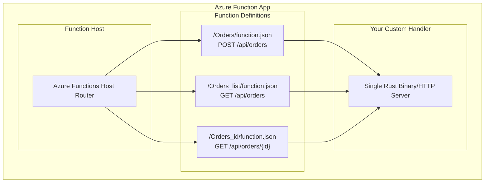

In my [previous post]({{site.url}}/blog/2025/07/26/serverless-rust-on-azure-deploying-a-rust-azure-function.html), we deployed a simple "Hello World" Rust function to Azure. Now we're ready to build something production-worthy: a database-backed REST API that handles real business logic. We'll create a cake ordering system for a local bakery, complete with data persistence, input validation, and proper error handling.

<!--more-->

## The Business Case: Sweet API Solutions

Before diving into code, let's establish what we're building. Our fictional bakery needs a digital ordering system where:

- Bakery staff can create custom cake orders taken from counter or phone customers
- Each order tracks customer information, custom text to be printed on the cake, and cake style selections
- Staff can view and manage all orders for fulfillment tracking
- Orders persist in a database for inventory management and operational workflows

Note: We're not implementing user authentication or authorization in this tutorial - that's a topic for future posts. This API is designed for internal bakery operations.

This scenario showcases real-world serverless patterns: event-driven APIs, NoSQL data modeling, input validation, and stateless request handling. It's complex enough to demonstrate production considerations while remaining approachable for learning.

You can find the complete code on GitHub: [https://github.com/shinglyu/serverless-rust-on-azure/tree/api-with-db](https://github.com/shinglyu/serverless-rust-on-azure/tree/api-with-db).

## API Design

Before building the implementation, let's design our API endpoints and data schema. Our cake ordering system needs three core operations:

**API Endpoints:**

- `POST /api/orders` - Create a new cake order
- `GET /api/orders` - List all orders (for staff to see pending work)
- `GET /api/orders/{id}` - Get a specific order by ID

**Data Schema Rationale:**

Each order contains:
- **Order ID**: UUID for unique identification across the system
- **Customer ID**: UUID to track repeat customers and link orders
- **Custom Text**: The message to be printed on the cake (limited to 50 ASCII characters for printing constraints)
- **Cake Style**: Predefined options to ensure bakery can fulfill (vanilla-flowers, chocolate-hearts, etc.)
- **Status**: Workflow tracking (pending, in-progress, ready, completed)
- **Created At**: When the order was placed (for tracking and fulfillment scheduling)
- **Pickup Date**: When the customer wants to collect the cake

## Understanding Azure Functions for Multi-Endpoint APIs

In the previous post, there was only one API endpoint, but for this use case, we need multiple API endpoints. Before we start coding, let's understand how Azure Functions differs from AWS Lambda in handling multi-endpoint APIs.

### The One-Binary, Multiple-Functions Model

Unlike AWS Lambda where each function is typically a separate deployment unit, Azure Functions with custom handlers works differently.

In our dedicated App Service Plan, there's one Azure Functions Host running on each underlying VM instance. This host communicates with your single custom handler (web server). You can reference the [official Microsoft documentation on custom handlers](https://learn.microsoft.com/en-us/azure/azure-functions/functions-custom-handlers) for detailed architecture diagrams.

Conceptually, you can think of this as:


**Key insights:**

1. **Shared Code Base**: All your functions' code are in the same binary, and they run as one Warp web server. 
2. **No Function Isolation**: Unlike Lambda's separate execution contexts, your functions share memory and state within the same process.
3. **Configuration-Based Routing**: `function.json` files define HTTP routes and triggers, but your Rust code handles the actual request processing.

This means the "Function" in an Azure Function App are more of a logical construct that has a route and trigger configuration, but not actually separate deployment units. Your custom handler is just a normal web server with multiple routes. So the common web server best practices like using share database connection, extract shared code (e.g. validation, payload formatting) into reusable modules applys here. 

## Database Choice: Azure Cosmos DB (Emulator)

For this tutorial, we'll use Azure Cosmos DB with the local emulator. Cosmos DB is Microsoft's globally distributed, multi-model database service that fits perfectly with serverless architectures.

### Understanding Cosmos DB Architecture

Before diving into implementation, let's understand Cosmos DB's hierarchy. Every Cosmos DB deployment follows this structure:

**Account → Database → Container → Items**

- **Cosmos DB Account**: Contains a unique DNS name and defines regions for replication
- **Database**: A logical grouping of containers with optional shared throughput
- **Container**: The actual data store (think table, collection, or graph depending on API choice)
- **Items**: Individual documents, rows, nodes, or edges stored within containers

You can find some nice diagrams about this concetp in [Microsoft Cosmos DB Documentation](https://learn.microsoft.com/en-us/azure/cosmos-db/resource-model)*

### Why Cosmos DB for Serverless?

**Automatic Scaling**: Cosmos DB scales throughput and storage automatically based on demand, matching the serverless philosophy of paying only for what you use.

**Global Distribution**: Built-in multi-region replication with configurable consistency levels, ideal for global serverless applications.

**Multiple APIs**: Support for NoSQL, MongoDB, Cassandra, and Gremlin APIs, giving you flexibility in data modeling.

**Serverless Pricing**: Request unit (RU) based billing with two throughput models:
- **Dedicated**: Throughput provisioned at the container level
- **Shared**: Throughput provisioned at the database level and shared across containers

**Schema Flexibility**: Only requires a partition key; items don't need the same schema, perfect for evolving APIs.
%%% Mention that we choose to use the NoSQL API because it's the most mature one and we don't need special API like graph or MongoDB because we don't have any legacy to migrate from.
### Local Development Setup

For this tutorial, we'll focus entirely on local development using the Cosmos DB emulator. This approach lets us:
- Develop without Azure account costs
- Work offline and experiment with quick iterations
- Test database scenarios without cloud connectivity issues

*Cloud deployment and production configuration will be covered in the next post in this series.*

## Building the Data Layer

Let's start by defining our domain model and database integration. Our cake ordering system needs to handle orders with customer information, cake specifications, and scheduling.

### Dependencies Setup

First, update your `Cargo.toml` to include the necessary dependencies:

```toml
[dependencies]
azure_data_cosmos = { version = "0.25.0", features = ["key_auth"] }
azure_core = "0.26.0"
serde = { version = "1", features = ["derive"] }
serde_json = "1"
warp = "0.3"
tokio = { version = "1", features = ["rt", "macros", "rt-multi-thread"] }
uuid = "1.17.0"
chrono = { version = "0.4.41", features = ["serde"] }
reqwest = "0.12.22"  # For testing
futures-util = "0.3.31"
```

The key additions are:
- `azure_data_cosmos`: Official Azure Cosmos DB SDK for Rust
- `uuid`: For generating unique order IDs
- `chrono`: For handling dates and timestamps with proper serialization

### Cosmos DB Emulator Setup

Before implementing our data models, you'll need to set up the Cosmos DB emulator for local development. The emulator runs in a Docker container on Linux systems. You can follow the [official Microsoft documentation](https://learn.microsoft.com/en-us/azure/cosmos-db/how-to-develop-emulator?tabs=docker-linux%2Ccsharp&pivots=api-nosql) for detailed setup instructions.

The basic setup involves pulling the Docker image and running it with the appropriate port mappings and SSL certificate configuration. Once running, the emulator provides a local endpoint at `https://localhost:8081` that mimics the cloud Cosmos DB service.
%%% mention the full URL with <something>/index.html, reference the notes.md
%%% Mention that the container might take several minute to start up, it will not respond to any request, so you might think the container fail to run, be patient and try again in a few minutes
%%% If you let the container run for too long, the authentication token used by the Web admin UI will expire, and you can't do any operation. I can't find a way to reauthenticate myself, so I simply restart the container. 

## Warp Framework Fundamentals

%%% Have a bridge here saying that in the previous post, the Microsoft documentation (add link) use Wrap as an example, so we are continue to use them
Warp is a lightweight, composable web framework that fits perfectly with Azure Functions' custom handler model. Unlike traditional MVC frameworks, Warp uses a filter-based approach that's both powerful and performant.

### Why Warp?

**Filter Composition**: Build complex routing logic by combining simple, reusable filters.
**Async-First Design**: Built from the ground up for async/await, with excellent performance characteristics.
**Type Safety**: Compile-time guarantees for request parsing and response generation.
**Minimal Overhead**: Low resource usage, crucial for serverless cold starts.

### Core Concepts

Warp organizes request handling around three main concepts:

1. **Filters**: Functions that either accept or reject requests, potentially extracting data
2. **Handlers**: Async functions that process accepted requests and generate responses
3. **Replies**: Type-safe response builders for HTTP responses

Here's how they work together:

```rust
use warp::Filter;

// Filter: Extract JSON body and validate it
let json_body = warp::body::json::<CreateOrderRequest>();

// Filter: Inject shared database client, which will be explained in detail later
let database_filter = warp::any().map({
    let container_client = Arc::clone(&container_client);
    move || Arc::clone(&container_client)
});

// Combined filter + handler
let create_order = warp::post()
    .and(warp::path("api"))
    .and(warp::path("orders"))
    .and(json_body)
    .and(database_filter)
    .and_then(create_order_handler);
```

Don't worry if you don't fully grasp this code snippet. We'll explain each part in this post. This filter composition makes it easy to share validation logic, database connections, and error handling across multiple endpoints.

## Implementing RESTful Endpoints

Let's build our three main endpoints progressively, starting with order creation and building up to the complete CRUD API.

### POST /api/orders - Creating Orders

The order creation endpoint demonstrates input validation, business logic, and database interaction:

%%% For this example code, do not invent a new handler, use the code on github directly, but omit the database because we haven't explained database connection yet. 
```rust
use warp::reply::json;
use std::convert::Infallible;

async fn create_order_handler(
    req: CreateOrderRequest,
    container_client: Arc<ContainerClient>
) -> Result<impl warp::Reply, Infallible> {
    // Validation logic here (covered in next section)
    
    // Generate order ID and timestamp
    let order_id = Uuid::new_v4().to_string();
    let now = Utc::now();
    
    let order = Order {
        id: order_id.clone(),
        customer_id: req.customer_id.clone(),
        custom_text: req.custom_text.clone(),
        cake_style: req.cake_style.clone(),
        status: "pending".to_string(),
        created_at: now,
        pickup_date: req.pickup_date,
    };

    // Store in Cosmos DB
    let partition_key = azure_data_cosmos::PartitionKey::from(order.customer_id.clone());
    let result = container_client.upsert_item(partition_key, order.clone(), None).await;

    match result {
        Ok(_) => Ok(warp::reply::with_status(
            json(&order),
            warp::http::StatusCode::OK,
        )),
        Err(e) => Ok(warp::reply::with_status(
            json(&serde_json::json!({"error": format!("DB error: {:?}", e)})),
            warp::http::StatusCode::INTERNAL_SERVER_ERROR,
        )),
    }
}
```

**Key implementation details:**

- **Partition Key Strategy**: Using `customer_id` as the partition key distributes orders across multiple physical partitions for better performance.
- **Upsert vs Insert**: Using `upsert_item()` instead of `create_item()` handles potential duplicate requests gracefully.
- **Error Conversion**: The `Infallible` return type means our handler never panics, converting all errors to proper HTTP responses.

### Database Connection Setup
%%% Add a bridge say we now need to have a database connection so we can acutally write to the database
%%% Explain the rationale why we want to create one clinet and share it with all routes. If we initiate a clinet in each route we slow down the service. 

Setting up the Cosmos DB connection requires handling authentication and client initialization:

```rust
use azure_data_cosmos::CosmosClient;
use azure_data_cosmos::clients::ContainerClient;
use azure_core::credentials::Secret;
use std::sync::Arc;

const COSMOS_EMULATOR_URI: &str = "https://localhost:8081";
const COSMOS_DB_NAME: &str = "CakeDB";
const COSMOS_CONTAINER_NAME: &str = "Orders";

// Create shared Cosmos DB container client
let cosmos_key = env::var("COSMOS_EMULATOR_KEY").expect("COSMOS_EMULATOR_KEY required");
let client = CosmosClient::with_key(COSMOS_EMULATOR_URI, Secret::from(cosmos_key), None)
    .expect("Failed to create Cosmos client");
let database_client = client.database_client(COSMOS_DB_NAME);
let container_client = Arc::new(database_client.container_client(COSMOS_CONTAINER_NAME));
```

**Key architectural choices:**

- **Arc Wrapping**: We wrap the `ContainerClient` in `Arc` (Atomically Reference Counted) to safely share the database connection across multiple request handlers.
- **Environment Variables**: Database credentials come from environment variables, following twelve-factor app principles. Note that using static keys is appropriate for local development with the emulator, but in production we should implement proper Azure Entra ID authentication for security.

## Shared State Management
%%% Don't frame it as a positive, it's a side effect of lack of isolation, but don't critize it as well. Just mention it's a fact that this is designed like this
One of the biggest advantages of Azure Functions' custom handler model is the ability to share expensive resources across multiple requests. Database connections are prime candidates for this optimization.

### The Connection Pooling Challenge

Creating new database connections for every request is expensive:
- Network handshake overhead
- Authentication processing
- Connection establishment latency
- Resource cleanup costs

In a serverless environment where you pay for execution time, these costs add up quickly.

### Arc-based Shared State

Rust's `Arc` (Atomically Reference Counted) type provides a safe way to share data across async tasks:

```rust
use std::sync::Arc;

// Create the shared client once at startup
let container_client = Arc::new(database_client.container_client(COSMOS_CONTAINER_NAME));

// Warp filter to inject the shared client into handlers
let database_filter = warp::any().map({
    let container_client = Arc::clone(&container_client);
    move || Arc::clone(&container_client)
});
```

**How this works:**
1. **Single Connection**: One `ContainerClient` is created at application startup
2. **Reference Counting**: `Arc::clone()` creates additional references without copying the actual client
3. **Thread Safety**: `Arc` ensures the client can be safely shared across async tasks
4. **Automatic Cleanup**: When the last reference is dropped, the connection is automatically closed

### Warp Filter Integration

Warp's filter system makes dependency injection elegant and type-safe:

```rust
let create_order = warp::post()
    .and(warp::path("api"))
    .and(warp::path("orders"))
    .and(warp::body::json())
    .and(database_filter.clone())  // Inject the shared client
    .and_then(create_order_handler);

let get_orders = warp::get()
    .and(warp::path("api"))
    .and(warp::path("orders"))
    .and(warp::path::end())
    .and(database_filter.clone())  // Same client, different endpoint
    .and_then(get_orders_handler);
```

The `database_filter.clone()` creates a new filter that injects the same shared client into different handlers. This pattern scales to any number of endpoints without additional overhead.

### Performance Benefits

This shared state approach provides significant performance improvements:
- **Reduced Cold Start Time**: Connection established once, not per request
- **Lower Memory Usage**: Single connection pool instead of per-request connections
- **Better Throughput**: Eliminated connection establishment overhead
- **Cost Efficiency**: Reduced execution time directly translates to lower serverless costs

### Data Model Design
%%% Roll this for later

Our order system uses two main structures:

```rust
use serde::{Deserialize, Serialize};
use chrono::{DateTime, Utc};

#[derive(Debug, Serialize, Deserialize, Clone)]
pub struct Order {
    #[serde(rename = "id")]
    pub id: String,
    #[serde(rename = "customerId")]
    pub customer_id: String,
    #[serde(rename = "customText")]
    pub custom_text: String,
    #[serde(rename = "cakeStyle")]
    pub cake_style: String,
    pub status: String,
    #[serde(rename = "createdAt", with = "chrono::serde::ts_seconds")]
    pub created_at: DateTime<Utc>,
    #[serde(rename = "pickupDate", with = "chrono::serde::ts_seconds")]
    pub pickup_date: DateTime<Utc>,
}

#[derive(Debug, Serialize, Deserialize)]
pub struct CreateOrderRequest {
    #[serde(rename = "customerId")]
    pub customer_id: String,
    #[serde(rename = "customText")]
    pub custom_text: String,
    #[serde(rename = "cakeStyle")]
    pub cake_style: String,
    #[serde(rename = "pickupDate", with = "chrono::serde::ts_seconds")]
    pub pickup_date: DateTime<Utc>,
}
```
The Order struct maps to the CosmosDB "schema" (although it's technically schemaless), and the CreateOrderRequest is used as the input format for the POST /api/orders endpoint.


**Design decisions explained:**

1. **Serde Renaming**: The `#[serde(rename = "...")]` attributes ensure our Rust snake_case fields map to camelCase JSON, following JavaScript conventions for API consistency.

2. **Timestamp Handling**: Using `chrono::serde::ts_seconds` converts between Rust's `DateTime<Utc>` and Unix timestamp integers in JSON.

3. **Separate Request/Response Types**: `CreateOrderRequest` doesn't include generated fields like `id`, `status`, or `created_at`, enforcing proper API boundaries.
### GET /api/orders - Listing All Orders

The list endpoint demonstrates query execution and result aggregation:

%%% Also don't invent functions, use the code on github. 
```rust
async fn get_orders_handler(
    container_client: Arc<ContainerClient>
) -> Result<impl warp::Reply, Infallible> {
    let query = azure_data_cosmos::Query::from("SELECT * FROM c");
    let mut pager = container_client
        .query_items::<Order>(query, (), None)  // Empty () enables cross-partition queries
        .unwrap();

    let mut orders = Vec::new();
    while let Some(page) = pager.next().await {
        let page = page.unwrap();
        orders.push(page);
    }

    Ok(warp::reply::with_status(
        json(&orders),
        warp::http::StatusCode::OK,
    ))
}
```

**Cross-Partition Query Gotcha**: The Rust SDK documentation suggests that cross-partition queries aren't fully supported, but they actually work when you pass `()` as the partition key parameter. This allows the query to scan across all partitions to retrieve orders from different customers. However, be aware that cross-partition queries consume more RUs and have higher latency than single-partition queries.

This implementation uses Cosmos DB's SQL-like query syntax to retrieve all orders. The paged result handling ensures we collect all orders regardless of result set size.


### GET /api/orders/{id} - Single Order Retrieval

The single order endpoint shows parameterized queries and proper error handling:

```rust
async fn get_order_handler(
    id: String,
    container_client: Arc<ContainerClient>
) -> Result<impl warp::Reply, Infallible> {
    // Validation first
    if !is_valid_uuid(&id) {
        return Ok(warp::reply::with_status(
            json(&serde_json::json!({"error": "Invalid order ID format"})),
            warp::http::StatusCode::BAD_REQUEST,
        ));
    }

    // Secure parameterized query
    let query = azure_data_cosmos::Query::from("SELECT * FROM c WHERE c.id = @id")
        .with_parameter("@id", &id)
        .map_err(|_| {
            warp::reply::with_status(
                json(&serde_json::json!({"error": "Query parameter error"})),
                warp::http::StatusCode::INTERNAL_SERVER_ERROR,
            )
        })?;

    // Execute query and handle results
    let mut pager = container_client.query_items::<Order>(query, (), None).unwrap();
    
    let mut found: Option<Order> = None;
    while let Some(page) = pager.next().await {
        let page = page.unwrap();
        found = Some(page);
        break;
    }

    match found {
        Some(order) => Ok(warp::reply::with_status(
            json(&order),
            warp::http::StatusCode::OK,
        )),
        None => Ok(warp::reply::with_status(
            json(&serde_json::json!({"error": "Order not found"})),
            warp::http::StatusCode::NOT_FOUND,
        )),
    }
}
```

%%% Mention the pitfall that this is query scans all partitions, so it's slow. Ideally we want to have query patterns that use single-partition query. But since we have not implemented customer authentiocation yet, we don't have APIs that queries things for a single customer ID (which is our partition key). It will make more sense in future posts when we query order by a single customer. 

## Input Validation & Security

Production APIs require robust input validation and security measures. Our cake ordering system implements multiple validation layers to ensure data integrity and prevent common security vulnerabilities.

### Validation Strategy

We implement validation at three levels:
1. **Type-level validation**: Rust's type system prevents basic errors
2. **Format validation**: Check data formats (UUIDs, ASCII text, length limits)
3. **Business rule validation**: Enforce domain-specific constraints

### Validation Implementation

```rust
use uuid::Uuid;

// Hardcoded cake styles for business validation
const CAKE_STYLES: &[&str] = &[
    "vanilla-flowers",
    "chocolate-hearts", 
    "strawberry-rainbow",
    "vanilla-classic",
];

// Format validation helpers
fn is_valid_uuid(id: &str) -> bool {
    Uuid::parse_str(id).is_ok()
}

fn is_ascii_and_short(text: &str) -> bool {
    text.is_ascii() && text.len() <= 50
}

fn is_valid_cake_style(style: &str) -> bool {
    CAKE_STYLES.contains(&style)
}
```

### Applying Validation in Handlers

The validation functions integrate directly into our endpoint handlers:

```rust
%%% Add the outermost part that surrounds this code but omit details with //...
// In create_order_handler:
if !is_valid_uuid(&req.customer_id) {
    return Ok(warp::reply::with_status(
        json(&serde_json::json!({"error": "Invalid customerId UUID"})),
        warp::http::StatusCode::BAD_REQUEST,
    ));
}

if !is_ascii_and_short(&req.custom_text) {
    return Ok(warp::reply::with_status(
        json(&serde_json::json!({"error": "customText must be ASCII and ≤50 chars"})),
        warp::http::StatusCode::BAD_REQUEST,
    ));
}

if !is_valid_cake_style(&req.cake_style) {
    return Ok(warp::reply::with_status(
        json(&serde_json::json!({"error": "Invalid cakeStyle"})),
        warp::http::StatusCode::BAD_REQUEST,
    ));
}
```

**Benefits of this approach:**
- **Fail Fast**: Invalid requests are rejected immediately with clear error messages
- **Clear Boundaries**: Each validation function has a single responsibility
- **Reusable Logic**: Validation functions can be shared across endpoints and tested independently

### Security: Parameterized Queries

One of the most critical security measures is preventing SQL injection attacks. Even though Cosmos DB uses a SQL-like syntax, it's still vulnerable to injection if queries are constructed incorrectly.

**Wrong approach (vulnerable to injection):**
```rust
// DON'T DO THIS - Vulnerable to injection
let query = format!("SELECT * FROM c WHERE c.id = '{}'", user_input);
```

**Correct approach (secure with parameters):**
```rust
// DO THIS - Safe parameterized query
let query = azure_data_cosmos::Query::from("SELECT * FROM c WHERE c.id = @id")
    .with_parameter("@id", &id)?;
```

The `.with_parameter()` method properly escapes and validates the input, making injection attacks impossible. See the [documentation](https://learn.microsoft.com/en-us/azure/cosmos-db/nosql/query/parameterized-queries) to learn more about parameterized queries.


## Testing the API

Testing database-backed APIs requires a different approach than testing pure functions. We need to verify both the HTTP interface and the database interactions work correctly.

### Local Testing Setup

First, ensure you have the Cosmos DB emulator running and configure your environment:

```bash
# Set up local.settings.json
{
  "IsEncrypted": false,
  "Values": {
    "AzureWebJobsStorage": "",
    "FUNCTIONS_WORKER_RUNTIME": "custom",
    "COSMOS_EMULATOR_KEY": "your-cosmos-emulator-key-here"
  }
}
```

Start your function locally:
```bash
func start
```

### Manual Testing with curl

Test the complete order lifecycle:

```bash
# Create a new order
curl -X POST "http://localhost:7071/api/orders" \
  -H "Content-Type: application/json" \
  -d '{
    "customerId": "123e4567-e89b-12d3-a456-426614174000",
    "customText": "Happy Birthday Sarah!",
    "cakeStyle": "vanilla-flowers",
    "pickupDate": 1735689600
  }'

# List all orders
curl "http://localhost:7071/api/orders"

# Get specific order (use ID from create response)
curl "http://localhost:7071/api/orders/[order-id-here]"
```

### Integration Testing with Rust

For automated testing, we can use the `reqwest` crate together with Rust's built-in test runner to test our API:


%%% Don't invent code, reference github and include one example 9e.g. test_create_order with the bare minimum supporitng code that makes it run. Omit the other part. 
```rust
#[cfg(test)]
mod tests {
    use super::*;
    use reqwest;
    use serde_json::json;

    const BASE_URL: &str = "http://localhost:7071/api/orders";

    #[tokio::test]
    async fn test_create_and_retrieve_order() {
        let client = reqwest::Client::new();
        
        // Create order
        let create_payload = json!({
            "customerId": "123e4567-e89b-12d3-a456-426614174000",
            "customText": "Test order",
            "cakeStyle": "vanilla-flowers",
            "pickupDate": 1735689600
        });

        let response = client
            .post(BASE_URL)
            .json(&create_payload)
            .send()
            .await
            .unwrap();
            
        assert!(response.status().is_success());
        
        let order: Order = response.json().await.unwrap();
        assert_eq!(order.custom_text, "Test order");
        
        // Retrieve the created order
        let get_response = client
            .get(&format!("{}/{}", BASE_URL, order.id))
            .send()
            .await
            .unwrap();
            
        assert!(get_response.status().is_success());
        
        let retrieved_order: Order = get_response.json().await.unwrap();
        assert_eq!(retrieved_order.id, order.id);
    }
}
```

Run tests with:
```bash
cargo test --test api_integration
```

%%% Add a screenshot here

### Build Process

The build process remains the same as our previous tutorial:

```bash
# Build for Linux deployment
cargo build --release --target=x86_64-unknown-linux-musl
cp target/x86_64-unknown-linux-musl/release/handler .
```

%%% Interlace this section into the part we implements the API
### Function Configuration

Each endpoint requires its own function definition. Create the following folder structure:

```
Orders/
  function.json
Orders_list/
  function.json  
Orders_id/
  function.json
```

**Route Customization**: By default, Azure Functions would create routes like `/api/Orders` (matching the folder name), but you can customize these using the `route` parameter in `function.json`.

Example `Orders/function.json` for the POST endpoint:

```json
{
  "bindings": [
    {
      "authLevel": "anonymous",
      "type": "httpTrigger",
      "direction": "in",
      "name": "req",
      "methods": ["post"],
      "route": "orders"
    },
    {
      "type": "http",
      "direction": "out",
      "name": "res"
    }
  ]
}
```

For the nested path endpoint, create `Orders_id/function.json`:

```json
{
  "bindings": [
    {
      "authLevel": "anonymous",
      "type": "httpTrigger",
      "direction": "in",
      "name": "req",
      "methods": ["get"],
      "route": "orders/{id}"
    },
    {
      "type": "http",
      "direction": "out",
      "name": "res"
    }
  ]
}
```

%%% Add a short note mentioneing that for the emualtor we are not implementing Entra ID authentication yet, so we are using the key for auth, this goes into the Function App as environment variables to avoid hard-coding credential here. Move this section to where we first use this credential. 
**Environment Variables**: For local development, configuration goes in `local.settings.json` and is automatically gitignored. In the cloud, you'll use Azure App Settings instead.

This configuration tells Azure Functions to route POST requests to `/api/orders` and GET requests to `/api/orders/{id}` to your custom handler.

## What's Next?

This tutorial covered the fundamentals of building database-backed serverless APIs with Rust on Azure. We've created a production-ready foundation, but there's much more to explore:

### Coming in the next post
- **Cloud Cosmos DB deployment** with proper authentication and networking
- **User authentication and authorization** with Azure Active Directory
- **CI/CD pipeline setup** for automated testing and deployment

### Future Work

**Business Features:**
- **Upload custom images** to be printed on the cake using Azure Blob Storage
- **Change order status** with endpoints for updating order workflow states (pending, in-progress, ready, completed)
- **Customer-facing API** with proper authentication for online ordering

**Technical Enhancements:**
- **Structured logging and monitoring** with Application Insights
- **Error tracking and alerting** for production reliability
- **Multi-region deployment** for global availability

**Architecture Evolution:**
- **Azure API Management** for proper API management features
- **Event-driven patterns** with Azure Service Bus and Event Grid
- **File processing** with Azure Blob Storage triggers
- **Scheduled functions** for background processing
- **Durable Functions** for long-running workflows

## Conclusion
%%% This conclusion is too weak, we arleady mentioned these in the previous, focus on the fact that we added a database in this post. 

Building serverless APIs with Rust on Azure provides a compelling combination of performance, safety, and cost-effectiveness. The custom handler model allows for sophisticated architectures while maintaining the simplicity of serverless deployment.

Key takeaways from this tutorial:

**Architectural Benefits**: The one-binary, multiple-functions model enables efficient resource sharing and consistent business logic across endpoints.

**Performance Advantages**: Shared database connections and Rust's zero-cost abstractions deliver excellent performance characteristics for serverless workloads.

**Security by Design**: Type-safe request handling, parameterized queries, and comprehensive input validation create robust APIs resistant to common vulnerabilities.

**Developer Experience**: Warp's filter composition and Rust's error handling make complex API logic manageable and maintainable.

The next post will take this foundation to production, covering cloud deployment, security hardening, and operational concerns. Stay tuned for the complete journey from local development to production-ready serverless APIs!
