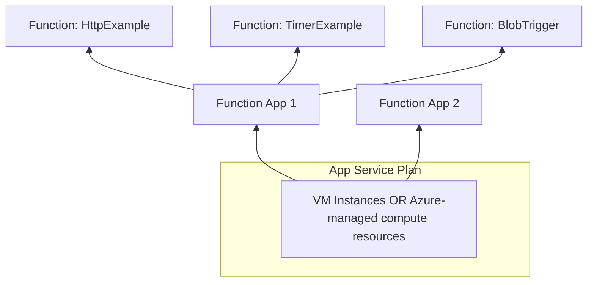

This is the first post in my new series on serverless Rust on Azure. We'll start simple by following the official Azure tutorial, with my notes on the caveats and tweaks I've made along the way. Having worked with AWS for the past 6 years, I'll also highlight key differences from AWS Lambda.

You can find the complete code on GitHub: [https://github.com/shinglyu/serverless-rust-on-azure](https://github.com/shinglyu/serverless-rust-on-azure).


## Why Rust for Serverless?

Before diving into the implementation, let's explore why Rust makes an excellent choice for serverless functions. I assume you already have some idea on waht Rust and serverless are. If not, read the [Why Rust](https://www.rust-lang.org/) page and [Azure documentation](https://learn.microsoft.com/en-us/azure/architecture/guide/technology-choices/compute-decision-tree) and focus on Azure Functions on that page. 
<!--more-->

### General Benefits of Rust

Rust provides strong compile-time guarantees for memory safety, type safety, and thread safety, preventing common bugs like null pointer dereferences, data races, and buffer overflows without needing a garbage collector.

These safety guarantees are enforced by concepts like ownership, borrowing, and the borrow checker, which statically verify correct use of memory and concurrency before runtime, giving developers confidence in code correctness and security.

Rust clearly separates Safe Rust, which enforces these guarantees, from Unsafe Rust, which allows manual low-level control but is explicitly marked and isolated, making unsafe operations traceable and minimizing risk to the overall program safety.

But these benefits apply to any environment, not just serverless. Below are some benefits that are specific to a serverless environment.

### Serverless-Specific Advantages

**Fast Cold Starts**: Rust compiles to native code with no runtime or garbage collector, enabling cold start times as low as 50–75 ms, much faster than interpreted languages like Python or JavaScript.

**Low Memory Usage**: Rust's efficient use of memory reduces resource consumption, lowering serverless execution costs and making it ideal for resource-constrained environments.

**High Performance**: Near-native execution speed improves throughput and reduces execution time, which directly cuts serverless billing costs based on compute duration.

**Small, Compact Binaries**: Rust produces tiny deployment artifacts, enabling faster uploads and less cold start overhead.

**Sustainability and Cost Efficiency**: By reducing compute and memory consumption, Rust aligns well with green computing goals in pay-per-use serverless environments.

### What is Azure Functions?

Azure Functions is Microsoft's Function-as-a-Service (FaaS) platform that allows you to run code without managing infrastructure. It follows an event-driven model where your code executes in response to triggers like HTTP requests, timer schedules, or messages from other Azure services.

Unlike traditional web servers that run continuously, Azure Functions focus on discrete units of work triggered by specific events. This makes it ideal for microservices, APIs, data processing pipelines, and integration scenarios.

Azure Functions offers different hosting plans. Some are truly serverless with pay-per-execution billing, while others run on underlying VMs for more predictable performance. We'll dive deeper into these pricing models and their trade-offs later in this tutorial.

## Prerequisites and Setup

I'll walk you through a Hello World example for running Rust on Azure Fucntions, following the [official Microsoft guide](https://learn.microsoft.com/en-us/azure/azure-functions/create-first-function-vs-code-other?tabs=rust%2Clinux) with my real-world insights.

Before we begin, ensure you have the following installed:

- **Azure Functions extension for VS Code**: Install from the VS Code marketplace.
<<Insert /home/shinglyu/workspace/shinglyu.github.io/blog_assets/rust-serverless-azure-hello-world/azure-function-extension-marketplace.png>>
- **Rust toolchain**: I'm using Rustc 1.88.0.
- **Azure Function Core Tools**: Essential for local testing
  - Follow the [official installation guide](https://learn.microsoft.com/en-us/azure/azure-functions/functions-run-local?tabs=linux%2Cisolated-process%2Cnode-v4%2Cpython-v2%2Chttp-trigger%2Ccontainer-apps&pivots=programming-language-python).  On Ubuntu, that means adding the apt repository and install with `apt install`

## Creating Your First Function

### 1. Create Local Project

We'll start by creating a new Azure Functions project using VS Code's integrated tooling. Open the VS Code command palette with `F1` and search for "Azure Functions: Create New Project".
<<Insert /home/shinglyu/workspace/shinglyu.github.io/blog_assets/rust-serverless-azure-hello-world/vscode-create-project.png>>
When prompted for the language, select "Custom Handler" because Azure Functions doesn't have native Rust support yet. Custom handlers provide a way for Azure Functions to support any language that can run an HTTP server, which makes them perfect for languages like Go and Rust.

Next, choose the "HTTP trigger" template since we want to create a simple web API endpoint that responds to HTTP requests. This is the most common trigger type and serves as an excellent starting point for learning Azure Functions.

Name your function "HelloRust" to clearly identify it as a Rust-based function. Finally, set the authorization level to "Anonymous" so we can test the function easily without setting up authentication mechanisms during development.

Once you are done, this is how it should look like:
<<Insert /home/shinglyu/workspace/shinglyu.github.io/blog_assets/rust-serverless-azure-hello-world/project-created.png>>

### 2. Create and Build the Function Code

Now we need to create the actual Rust application that will handle HTTP requests. Since Azure Functions uses the custom handler approach for Rust, we're essentially building a standalone HTTP server that Azure Functions will communicate with.

Initialize a new Rust project in your function directory using Cargo. We name it "handler" because this will be the executable name that Azure Functions looks for:

```bash
cargo init --name handler
```

Next, we need to add dependencies to our `Cargo.toml` file. We're using Warp as our web framework because it's lightweight, fast, and has excellent async support. Tokio provides the async runtime that Warp requires:

```toml
[dependencies]
warp = "0.3"
tokio = { version = "1", features = ["rt", "macros", "rt-multi-thread"] }
```

Now let's write the actual handler code in `src/main.rs`. This creates a simple HTTP server using the Warp framework that mimics the behavior expected by Azure Functions:

```rust
use std::collections::HashMap;
use std::env;
use std::net::Ipv4Addr;
use warp::{http::Response, Filter};

#[tokio::main]
async fn main() {
    let example1 = warp::get()
        .and(warp::path("api"))
        .and(warp::path("HelloRust"))  // Critical: Match your function name
        .and(warp::query::<HashMap<String, String>>())
        .map(|p: HashMap<String, String>| match p.get("name") {
            Some(name) => Response::builder().body(format!("Hello, {}. This HTTP triggered function executed successfully.", name)),
            None => Response::builder().body(String::from("This HTTP triggered function executed successfully. Pass a name in the query string for a personalized response.")),
        });

    let port_key = "FUNCTIONS_CUSTOMHANDLER_PORT";
    let port: u16 = match env::var(port_key) {
        Ok(val) => val.parse().expect("Custom Handler port is not a number!"),
        Err(_) => 3000,
    };

    warp::serve(example1).run((Ipv4Addr::LOCALHOST, port)).await
}
```

**Critical Caveat**: Make sure to change the `warp::path("HelloRust")` to match your function name exactly, including the `/api/` prefix.

Now we need to build our Rust application and place the executable where Azure Functions can find it. Build the release version for optimal performance and copy it to the project root:

```bash
cargo build --release
cp target/release/handler .
```

The handler executable must be in the project root directory because this is where the Azure Functions extension expects to find it during deployment.

### 3. Configure Function App

Azure Functions needs to know how to communicate with our custom Rust handler. We do this by updating the `host.json` configuration file with custom handler settings.

The `host.json` file should be located in your project root and contain the following configuration:

```json
{
  "version": "2.0",
  "customHandler": {
    "description": {
      "defaultExecutablePath": "handler",
      "workingDirectory": "",
      "arguments": []
    },
    "enableForwardingHttpRequest": true
  }
}
```

The `defaultExecutablePath` tells Azure Functions which binary to execute (our "handler" executable).

`enableForwardingHttpRequest: true` makes HTTP-triggered requests go straight to your handler as standard HTTP requests—preserving headers, method, path, and query string. This is ideal for HTTP-only functions (with no extra bindings), letting your handler act like a regular web server. If set to `false` (the default), the host wraps the request in a custom payload instead.

### 4. Test Locally

Now it's time to test our function locally before deploying to Azure. This step is crucial for catching issues early and ensuring everything works as expected.

Before starting the local server, you might encounter a common error: "The value of version property in extensionBundle section of host.json file is invalid or missing." This happens because Azure Functions needs to know which version of the extension bundle to use for binding support, and the official tutorial seems to miss it.

Fix this by adding the version number for the `extensionBundle` setting in `host.json`:

```json
{
  "version": "2.0",
  "extensionBundle": {
    "id": "Microsoft.Azure.Functions.ExtensionBundle",
    "version": "[4.0.0, 5.0.0)"
  },
  "customHandler": {
    // ... your existing settings
  }
}
```

With the configuration fixed, start the local development server using the Azure Functions Core Tools:

```bash
func start
```

This command starts both the Azure Functions runtime and your Rust HTTP server running as a function. You should see output indicating that your function is available at `http://localhost:7071/api/HelloRust`.

Test the function using curl to verify it's working correctly:

```bash
curl "http://localhost:7071/api/HelloRust?name=Shing" -v
```

If everything is working properly, you should see output like this:

```
HTTP/1.1 200 OK
Content-Length: 65
Date: Mon, 21 Jul 2025 14:45:46 GMT
Server: Kestrel

Hello, Shing. This HTTP triggered function executed successfully.
```

This confirms that your Rust function is correctly receiving HTTP requests through the Azure Functions runtime and responding appropriately.

### 5. Prepare for Azure Deployment

Before we can deploy to Azure, we need to prepare our Rust binary for the Linux environment that Azure Functions uses. This involves cross-compilation to ensure our binary runs correctly in Azure's infrastructure.

First, add the Linux musl target to your Rust toolchain:

```bash
rustup target add x86_64-unknown-linux-musl
```

Even though I'm already running on Linux, my default target is `stable-x86_64-unknown-linux-gnu`, which uses the system glibc (GNU C Library). glibc is the standard C library on most Linux distributions, while musl is a lightweight alternative designed for static linking and portability. The musl target is important because it produces statically linked binaries that run on virtually any Linux system, avoiding potential issues with missing or incompatible system libraries in the Linux environment inside the Azure Function.

Create a `.cargo/config` file in your project to configure cross-compilation:

```toml
[target.x86_64-unknown-linux-musl]
linker = "rust-lld"
```

Now build the Linux-compatible binary:

```bash
cargo build --release --target=x86_64-unknown-linux-musl
cp target/x86_64-unknown-linux-musl/release/handler .
```

**Linker Issues**: If you encounter linking problems because your `ld` is set to Homebrew's linker (common when using Homebrew on Linux), temporarily use the system linker instead:

```bash
export PATH="/usr/bin:$PATH"
cargo build --release --target=x86_64-unknown-linux-musl
cp target/x86_64-unknown-linux-musl/release/handler .
```

Finally, update your `.funcignore` file to exclude the target folder from deployment, since we only need the final `handler` binary:

```
target
```

### 6. Deploy to Azure

Before we can deploy the Rust code to Azure, we need to first create a Azure Function App to host the Azure Function. Let's first take a look at what Azure Function App is and how it works

#### Understanding Azure Function App Architecture
Before we learn about how to deploy the Auure Function 
Let me explain the hierarchy with a diagram:



An Azure Function App is a container for multiple individual functions that share the same compute resources and configuration. Underneath, the App Service Plan represents the actual infrastructure (VM instances) that run your apps.

Azure Functions supports different pricing models, called hosting options:
- **Consumption Plan**: True pay-per-execution (like AWS Lambda).
- **Dedicated Plan**: Traditional always-on VMs. Also known as the App Service Plan.
- **Premium Plan**: Always-onVM, supports pre-warmed instances with more features than Dedicated Plan.

There are also the Flex Consumption Plan and Container Apps.  I don't consider them because:
* Flex Consumption Plan doesn't support custom handlers, so Rust isn't available on that plan.
* Container Apps force you to build your code into containers. Since the focus of this series is on Serverless, I want to focus on Function-as-a-service abstration level rather than containers. 
You can learn more about these hosting options in the [documentation](https://learn.microsoft.com/en-us/azure/azure-functions/functions-scale).

The official tutorial suggests using a Premium hosting plan, but this isn't actually serverless because you pay for the underlying VM instances by the hour regardless of usage. For this hello world example, I chose the App Service plan (also called the Dedicated plan) instead for cost saving. It is similar to Premium's cost model but with fewer features. And also because that option is covered by the free credit in the specific sandbox Azure Subscription I'm experinementing on. 

#### Deployment Configuration

To create the Function App to host our function, first head over to the Azure Portal and search for "Function App" in the top search bar. Click "Create" to start a new Function App.  


You'll be prompted to fill in the required details:

- **Name**: hello-rust
- **Runtime stack**: Custom
- **Operating System**: Linux
- **SKU**: Basic
- **Memory**: 1.75 GB
- **Storage account**: Auto-generated
- **Hosting plan**: App Service
- **Basic authentication**: Disabled
- **Application Insights**: Not enabled (consider enabling for production)


Once you've filled in the details, review and create the Function App. Wait for deployment to complete—Azure will show a confirmation when it's done.  


After deployment, open your new Function App to see the overview.  


## Deploying Your Rust Function to Azure

Now comes the moment of truth—deploying your Rust function to the cloud! In VS Code, open the command palette and search for "Azure Functions: Deploy to Function App".  


Select the function app you just created in the Azure Portal. VS Code will warn you that deploying will overwrite any existing contents in that app—this is expected for new deployments, but be careful if you have other functions in the same app.
  

Once you confirm, VS Code will start uploading your code and assets to Azure.  


And once you seee the green check mark, your code is running on Azure!


## Testing the Azure Function


The official tutorial suggests using the "Execute Function Now" feature in VS Code:  


Here's the catch: the Azure Functions extension's default template defines both GET and POST methods for your function, but my Rust code only implements GET. Unfortunately, "Execute Function Now" always sends a POST request, and I couldn't find a way to switch it to GET. After some frustration, I gave up on this method and switched to testing via the Azure Portal instead.

In the portal, navigate to your Function App, and select the Hello Rust function, 
  
  

Then click on the "Test/Run" tab. Here you can specify the HTTP method, set query parameters, and send requests directly to your deployed function—making it easy to verify GET endpoints and see the actual output.  
  


With this, you can confidently confirm your Rust function is working as expected in the cloud.

## What's Next?

This tutorial covered the basics, but there's much more to explore in the serverless Rust on Azure ecosystem. What I'm planning to explore next are:

### Advanced Use Cases
- **API backed by CosmosDB**: Database integration
- **Blob Storage**: React on file uploads; Write files to Blog Storage
- **Timer Functions**: Scheduled background tasks
- **Event-driven Architectures**: Queues, Event Grid, etc. 
- **Orchestration**: Durable Function
- **Frontend Integration**: Rust frontend hosted on Azure Blob + CDN with CORS

### Production Considerations
- **Observability**: Structured logging, metrics, and distributed tracing
- **Security**: API authentication, HTTPS, Key Vault integration
- **Scaling**: Auto-scaling strategies and cold start optimization
- **CI/CD**: GitHub Actions with zero-downtime deployments
- **Disaster Recovery**: Multi-region setups with Traffic Manager

My readers also [suggested](https://www.linkedin.com/feed/update/urn:li:activity:7353725719459307521/):
- Integration with MongoDB Atlas 
- Serverless Rust via WASM

Send me an email to DM me on LinkedIn if you have any other suggestions!

## Conclusion

Rust brings compelling advantages to serverless computing: fast cold starts, low memory usage, and excellent performance. While Azure Functions' Rust ecosystem is less mature than AWS Lambda's (see [Cargo Lambda](https://www.cargo-lambda.info/) and [GA of AWS SDK for Rust](https://aws.amazon.com/blogs/developer/announcing-general-availability-of-the-aws-sdk-for-rust/)), the native HTTP Server approach simplifies the development a lot.

In the next post, we'll dive deeper into integrating with Azure databases and exploring more complex use cases. Stay tuned!