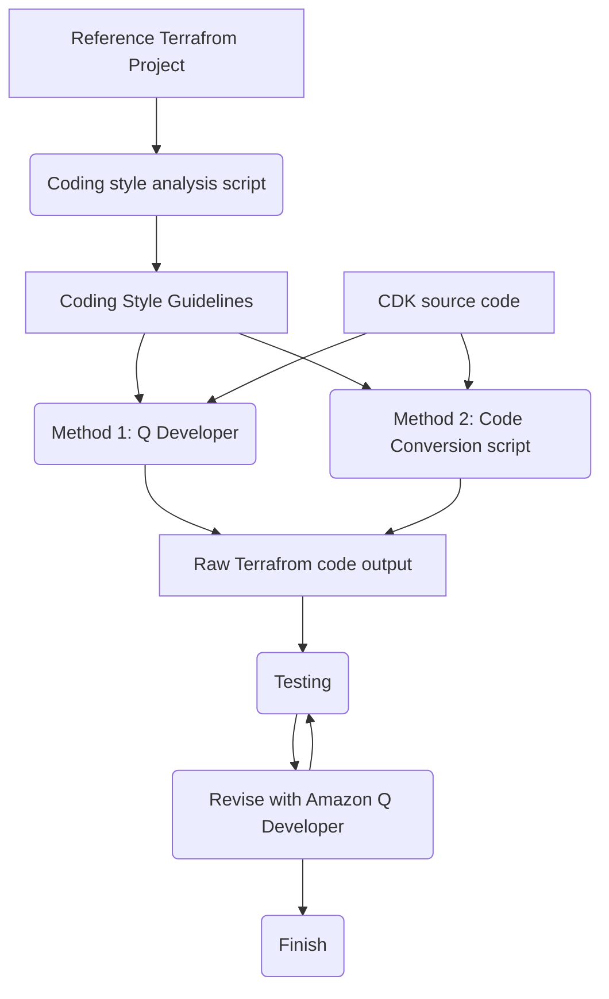
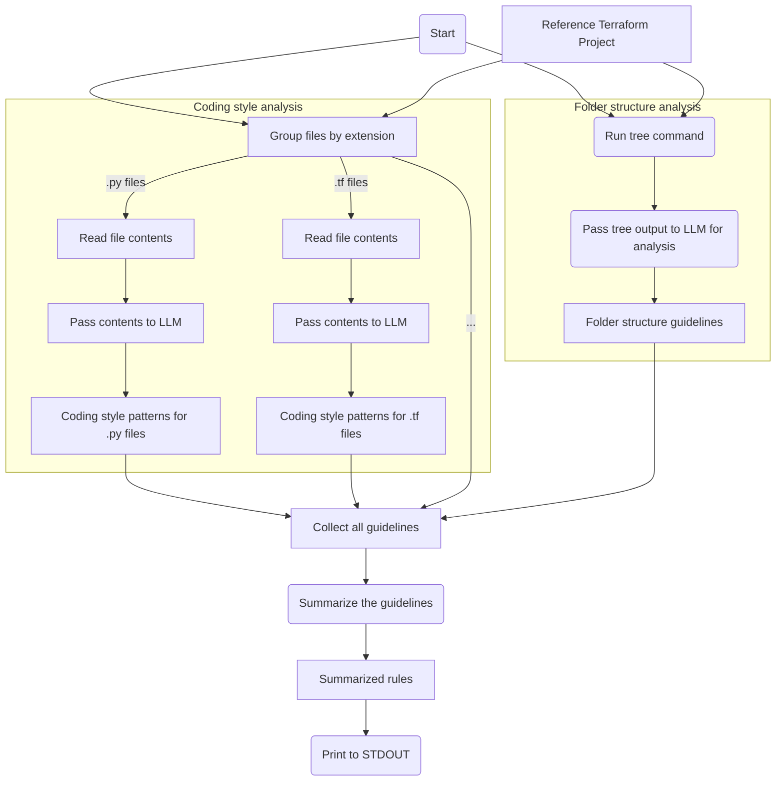
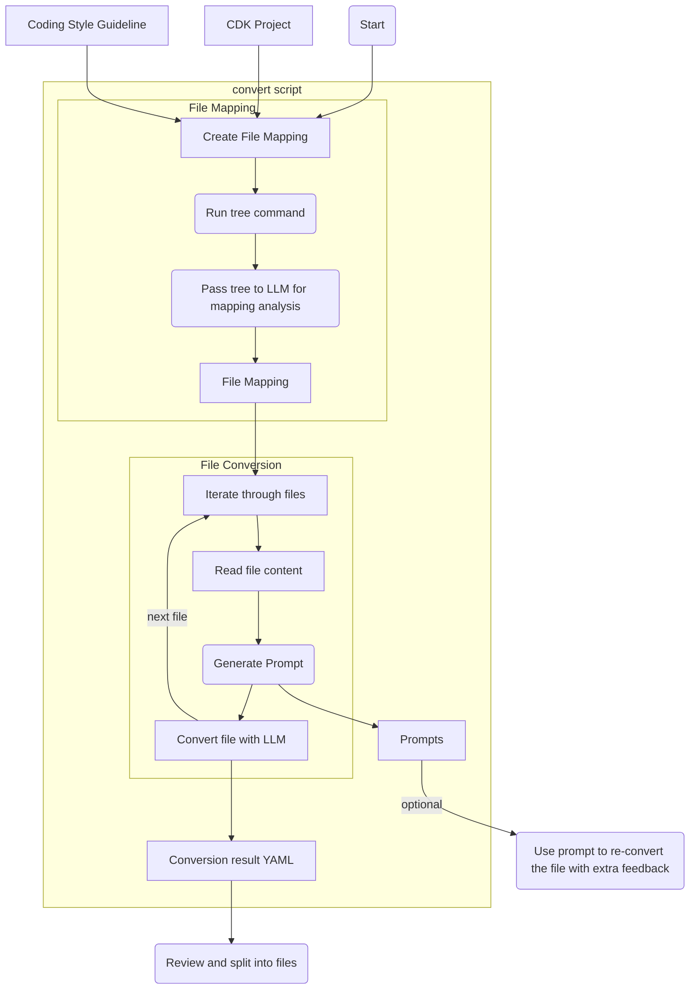

I recently worked on a project to migrate a CDK project to Terraform, because the client want to standarize on Terrafrom. This could have been a time-consuming job, and it requires expertise on both CDK and Terraform, but with the help from generative AI, especailly Amazon Q Developer and Amazon Bedrock, it becomes quite easy. This article will walk you through how I performed the migration and the lessons learned through the process.

<!--more-->

## Design considerations
This solution is designed based on these high-level priciples
1. Automate whenever you can: we automate the process as much as possible, including the coding style analysis and file conversion.
2. Provide human review and intervention checkpoints: The automation tool will output prompts used and intermediate results, so users can "fork" from the automated process and guide the migration process using Generative AI chatbots, if they are not satisfied with the generated output.
3. There are exisitng Terraform coding convention, but it's not documented. The clinet want the new Terraform code to follow their convention.
4. Tools used:
    * Bedrock (Claude 3.5 Sonnet) for automated processes
    * Amazon Q Developer for agent-based file convertion, manual fixing and revision

## Migration flow


1. A reference Terraform project is used as a starting point.

2. The reference project undergoes coding style analysis using a script. This analysis produces coding style guidelines in natural language.

3. The coding style guidelines are used in conjunction with the original CDK source code. Both inputs are fed into a code conversion script. The conversion script generates raw Terraform code output.

4. We then test the generated code using tools like `terrafrom` CLI and `pytest`. If issues are found during testing, the code is revised by the developer with help from Amazon Q Developer.

### Coding style analysis

The coding style analysis script takes a reference Terraform project and output its coding style guidelines. The script does it in a few steps:

1. The script runs the `tree` command to list the folder structures of the reference project, then pass the `tree` output to an LLM (Claude 3.5 Sonnect in Bedrock through the AWS SDK) to analyze the folder structure guidelines.
2. The script iterates through all files in the reference project, and group them by file extensions. For each file extension (e.g. `.tf`, `.py`), the script reading their contents and passing them to the LLM to analyze coding style patterns such as naming conventions, indentation, and code organization. Because the reference project is small, we fit all the example files into the prompt, for larger projects, you might need to use map reduce technique to analysis all the files.

3. The script collects outputs from steps 1-2 and combines them into a comprehensive set of guidelines. The combined guidelines are then passed through the LLM one final time to refine and organize them into a concise, coherent, human-readable format.

4. The final output is printed to STDOUT. You can pipe that to a text file. This output providing a clear and structured set of coding style guidelines derived from the reference project. The file will contains the raw rules, and a summarized rules from step 3.



The script uses [LangChain](https://python.langchain.com/docs/integrations/chat/bedrock/) to invoke Amazon Bedrock, and has built-in [rate limiting](https://python.langchain.com/docs/how_to/chat_model_rate_limiting/) to avoid being throttled by Bedrock. I do not include the script here because it contains business logic specific to the customer.

You can further refine the prompts used in the script, or take the prompt out and do the process manually in a chatbot for maximum control and interactive feedback loop.  You can review the generated coding style guidelines and make manual adjustments as needed. Here is an example of the output:

```
Folder structure:

project-root/
├── CHANGELOG.md
├── README.md
├── main.tf
├── variables.tf
├── outputs.tf
├── providers.tf
├── resource1.tf
├── resource2.tf
├── docs/
│   ├── README.md
│   └── update_docs.sh
└── example/
    ├── main.tf
    ├── variables.tf
    ├── outputs.tf
    ├── providers.tf
    ├── example.tfvars
    └── tests/
        └── module_test.py

Coding style by file extension:

Terraform (.tf, .tfvars):
1. Use snake_case for resource, variable, and output names.
2. Prefix AWS resource names with 'aws_'.
3. Group related resources and use comments to delineate sections.
4. Use 'for_each' for creating multiple similar resources.
5. Implement locals for complex calculations or transformations.
6. Use data sources to fetch existing information.
7. Utilize conditional expressions and dynamic blocks when appropriate.
8. Implement consistent indentation (2 spaces).
9. Include validations in variable definitions.
10. Use descriptive output names with descriptions.

Python (.py):
1. Follow PEP 8 style guide.
2. Use snake_case for variable and function names.
3. Use UPPERCASE for constants.
4. Limit line length to 79-100 characters.
5. Use docstrings for functions, classes, and modules.
6. Implement error handling with try-except blocks.
7. Use type hints for better code readability.
8. Follow the DRY (Don't Repeat Yourself) principle.

Markdown (.md):
1. Use consistent formatting for code blocks and tables.
2. Provide clear section headings and subheadings.
3. Include examples and usage instructions.
4. Document version information and compatibility requirements.
5. Use links for external resources and references.

JSON (.json, .meta):
1. Use PascalCase for key names.
2. Maintain consistent indentation (2 or 4 spaces).
3. Avoid unnecessary whitespace or empty lines.
4. Use descriptive names for keys and values.

Testing:
1. Write unit tests for individual functions and methods.
2. Use testing frameworks (e.g., pytest for Python, tftest for Terraform).
3. Organize tests in a separate "tests" directory.
4. Implement both positive and negative test cases.
5. Use fixtures and parameterized tests when appropriate.
6. For Terraform, test plan, apply, and destroy stages.
7. Verify resource creation, outputs, and destruction.
8. Compare Terraform outputs with actual cloud resources.

Documentation:
1. Maintain a comprehensive README.md with sections like Introduction, Getting Started,
```


### Code Conversion
There are two way to do code conversion: using Amazon Q Developer Agent or manually through a conversion script. The Amazon Q Developer method is easier and more robust. But if you wish to fully control the conversion process, choose the conversion script method.
#### Method 1 - Amazon Q Developer Agent

Amazon Q Developer Agent is a feature in Amazon Q Developer that help you do multi-file conversion and feature developement. You can learn more about how it works in this blog post: ([Reinventing the Amazon Q Developer agent for software development | AWS DevOps & Developer Productivity Blog](https://aws.amazon.com/blogs/devops/reinventing-the-amazon-q-developer-agent-for-software-development/)).
1. To use Amazon Q Developer Agent, first open a supported IDE (e.g. VSCode), and install the Amazon Q extension. The blog post above provides step-by-step insructions with screenshots.
2. Open the CDK folder you wish to convert.
3. Open the Amazon Q chat in the left side panel, and ask the chatbot to do the following (The `/dev` part is very important for triggering the Agent):

```
/dev convert this CDK project into Terraform, Put the terraform output in a folder called 'terraform'. Follow the guidelines below:
<Paste the coding style guidelines generated from the previous step here>
```

4. The agent will start reading your codebase and create a plan. It will present you with the files it created for you to review. If the code can be improved, you can provide feedback and it will regenerate. Once you are satisfied, accept the chatbot's proposal and copy the `terraform` folder to your desired location. Below are some screenshots of a Amazon Q Developer Agent chat session (some sensitive file names are redacted):


#### Method 2 - Conversion Script
(If you already used method 1, you can skip to the **Manually fixing the code** section.)
If you don't like the fully-automated method of Amazon Q Developer Agent, and want fine-grain control on the conversion file by file, you can write a script instead.
The code conversion script I wrote takes a CDK project as input and converts it to Terraform. The script takes the code guildeline text file from the previous step, and also the CDK project that needs to be converted. The script performs the conversion through several steps:

1. The script first creates a file mapping by running the tree command on the input CDK project directory. This tree structure is then passed to an LLM (Claude 3.5 Sonnet in Bedrock) to analyze and create a mapping of how each input file should be converted to one or more output Terraform files.

2. The script then iterates through all files in the input CDK project. For each file:

    - It reads the file content.
    - It passes the content to the LLM along with the file mapping created in step 1, instructing it to convert the CDK code to Terraform. It also take the coding style guideline from the previous step.

3. The LLM's output for each file is captured in a YAML format in the `output` directory, specifying the output filename(s) and content. Notice that one file might be split into multiple files, so the YAML output is a list of 1 to many output filenames and their content. The reason we don't directly generate a file is for the one-to-many relationship. You can in theory parse the YAML and generate multiple files directly. In my testing sometimes the output YAML is not well-formed and the parsing will fail, so I prefer to review the YAML first and copy-paste the content into files myself.

4. The prompt used in step 2 is also written in the `output` directory. So if you are not satisfied with the conversion result, you can take the prompt and use a chatbot (e.g. using the Amazon Bedrock console or Amazon Q Developer chat) to interactively convert the file and provide feedback.



### Manually fixing the code

Once you create all the files, open the folder in an IDE (e.g. VSCode) with Amazon Q Developer installed. You should test the code with Terraform tools.

1. Run `terraform fmt -check -recursive` to check for syntax error.
2. Run `terraform validate` to check for configuration error.
3. Run `python -m pytest` to run the generated python-based tests

Fix any syntax errors with the help from the auto-complete from Amazon Q Developer.

Actually, the testing instructions above were also suggested by Amazon Q Developer. If you ask Amazon Q using the chat feature (the hexagnoal icon on the left-hand-side menu), it will suggest you the commands to test it. For example,

```
Human: How do I check if the terrafrom code in this repository is syntatically correct and can execute correctly?
Amazon Q:  To check if the Terraform code in your repository is syntactically correct and can execute properly, you can use several Terraform commands. Here's a step-by-step approach:

    Syntax Validation:

    Use the terraform validate command to check for syntax errors and internal consistency:

    terraform validate

    This command will check your configuration files for valid syntax and will return any errors it finds. It's a quick way to catch basic mistakes.

    Code Formatting:

    While not strictly necessary for functionality, it's good practice to ensure your code is properly formatted. Use:

    terraform fmt

    This command will automatically format your Terraform configuration files to a canonical style. If you want to see which files would be changed without actually changing them, you can use:

    terraform fmt -check

    Initialize the Working Directory:

    Before you can fully test your Terraform code, you need to initialize the working directory:

    terraform init

    This command will download any necessary provider plugins and set up the backend.

    Plan Execution:

    To see what changes Terraform would make without actually making them, use: [1]

    terraform plan

    This command creates an execution plan, showing you what actions Terraform will take to change your infrastructure. It's a great way to catch potential issues before applying changes.

    Dry Run:

    If you want to do a more thorough check without actually creating or changing any resources, you can use:

    terraform plan -detailed-exitcode

    This will return a non-zero exit code if there are any changes or errors, which can be useful in CI/CD pipelines.

    Module Validation:

    If your Terraform configuration uses modules, you might want to validate each module individually. Navigate to each module directory and run the validate and plan commands.

    Variable Checks:

    Ensure all necessary variables are defined. You can create a terraform.tfvars file with dummy values for testing purposes.

    State Inspection:

    If you're working with existing infrastructure, you can use:

    terraform show

    This will show the current state of your infrastructure as Terraform understands it.

    Remember, while these steps can catch many issues, they can't guarantee that your Terraform code will work perfectly in every environment or scenario. It's always a good idea to have a proper testing environment where you can safely apply your Terraform configurations before deploying to production.

    Also, consider integrating these checks into your CI/CD pipeline. For example, you could run terraform validate and terraform plan as part of your pull request checks to catch issues early in the development process.
```

If you need to do complex multi-file changes, you can use the Amazon Q Developer chat `/dev` command.

For example, you can ask:

```
/dev Move all the terraform variables from main.tf to _variables.tf
```

Amazon Q Developer will plan and suggest a multi-file change for you to approve. Here is an example output from Amazon Q Developer:

```
Generating code ...

I'll share updates here as I work on this.

Summary of changes

I will begin by opening the relevant Terraform files to inspect their contents, focusing on main.tf and _variables.tf as mentioned in the problem statement.

I will close irrelevant files and select the variables in main.tf that need to be moved to _variables.tf. I will also select the existing content in _variables.tf to prepare for moving the variables.

Based on the selected code, I can see that the variables in main.tf need to be moved to _variables.tf. I will now proceed to update the _variables.tf file by appending the variables from main.tf to it.

It appears the previous attempt to move variables from main.tf to _variables.tf was partially successful, but encountered an error. I will now correct the syntax error in _variables.tf and ensure all variables are properly moved.

I will now move the remaining variables from main.tf to _variables.tf and ensure proper formatting to resolve the syntax error. This should complete the task of moving all Terraform variables as requested.

I will now remove the last remaining variable definition from main.tf and ensure there are no duplicate variable definitions in _variables.tf. This should complete the task of moving all Terraform variables as requested.

I will now remove the last remaining variable definition from main.tf and clean up _variables.tf by removing duplicate definitions. This should complete the task of moving all Terraform variables as requested.

The task of moving all Terraform variables from main.tf to _variables.tf has been completed successfully. All variables are now properly defined in _variables.tf, and main.tf no longer contains any variable definitions.

Files used
These fields can change throughout code generation

Reviewed: 2

main.tf

_variables.tf

Created: 0

Changed: 2

main.tf

_variables.tf

Deleted: 0

Would you like me to add this code to your project, or provide feedback for new code? You have 2 out of 3 code iterations remaining.
```

Keep iterating until the project is free from errors and can be deployed successfully.

One thing to be careful is that Amazon Q Developer agent has a folder size limit (200MB uncompressed. See https://docs.aws.amazon.com/amazonq/latest/qdeveloper-ug/software-dev.html#quotas). If you run `terrafrom init`, a `.terrafrom` folder containing the providers is created in the current folder, that is about 400MB, which will break Amazon Q Developer agent. If that happends, remove the `.terraform` folder, continue develop until you are confident, then re-run `terraform init`.

#### List of things fixed manually:


- Conditional creation of resources. The original CDK project creates different kind of resources based on a parameter. But Terraform lacks that feature, so I created two resoruces and used the `count` parmeter to be able to conditinally deploy one of the two, based on the parameter.
- Added missing `aws_region` variable in `example/main.tf`
- Added the S3 bucket policy and related access control.

## Conclusion
Migrating from CDK to Terraform can be challenging, but leveraging AI tools like Amazon Q Developer and Amazon Bedrock significantly streamlines the process. This approach combines automated analysis and conversion with human oversight, striking a balance between efficiency and quality. While AI handles the bulk of the conversion work, human expertise remains crucial for fine-tuning and ensuring the migrated code meets specific project requirements. As AI technology advances, we can expect even more powerful tools to emerge, further simplifying such migrations. However, the combination of AI assistance and human expertise will likely remain the most effective approach for complex infrastructure-as-code transitions.