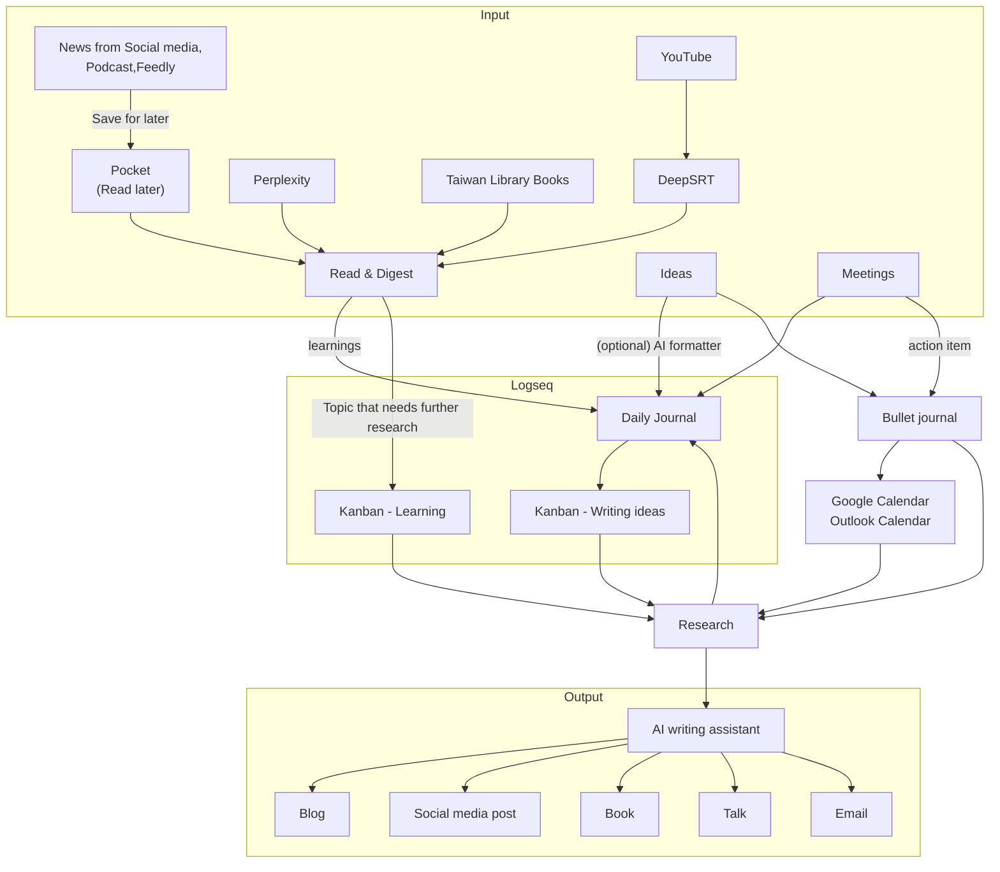

This is an updated version of my pre-ChatGPT [productivity post](https://shinglyu.com/productivity/2022/03/06/my-productivity-system.html). The landscape of productivity tools has changed dramatically since the AI boom, and my system has evolved accordingly.
The system is shown in the diagram above. Let me explain it in detail.
<!--more-->

## Getting input
I get news mostly from a few sources: social media, podcast, and RSS (using Feedly). I try to mitigate the information bubble (or THE ALGORITHM, whatever you call it) by subscribing to a collection of balanced RSS feeds from multiple news sources, they include news sites from different countries and different political views. For tech it's a combination of news sites, InfoQ, DZone and individual thinkers' blog.
If the article is too long to be read immediately, I'll save them to Pocket to read later. If it's even bigger than that, for example, a long research paper, book, or video course, I'd also save the link to a Kanban board in Logseq. For long YouTube videos, I use Pahud Hsieh's browser extension, [DeepSRT][DeepSRT] to get AI-generated summaries, which helps me decide whether to invest time in the full content.

Living in Europe, I've found a creative way to maintain my Chinese reading habits through the Taoyuan and Taipei Public Library's e-book service in Taiwan. Despite being halfway across the world, their digital library card gives me access to a vast collection of Chinese books that would be difficult or impossible to find in Europe. It's a fantastic resource that helps me stay connected with Chinese literature and keep my language skills sharp. Also, because the lease expires in 14 days, I'm more motiviated to finish the book. I read using the [HyRead app](https://tycccgov.ebook.hyread.com.tw/) on my Android phones and tablets.

One game-changing addition to my reading setup has been the Moaan InkPlum Plus e-reader. Its phone-sized form factor has been instrumental in breaking my doomscrolling habit - instead of mindlessly scrolling social media, I now find myself reaching for my e-reader. I specifically got the [Taiwanese version](https://www.bearboss.com/SalePage/Index/9809546) from Bearboss, which comes with access to the Google Play Store unlocked. This means I can install all my essential reading apps like various library apps, Kindle, and Pocket. The ability to consolidate all my reading materials on one e-ink device that fits in my pocket has significantly increased my reading time and improved the quality of my leisure moments. For PDF books with a lot of visuals, like recipe books or tech books with a lot of screenshots and code blocks, I read on my Android tablet. 


## Digest the information and take notes
Once I have the reading materials ready, I'd spend time reading them. This is denoted by the Research box to the left of the diagram. This could include reading, watching videos, doing research on Google, or building proofs-of-concept. 

I document my learnings in Logseq, which has become my primary note-taking tool. What I love about Logseq is how it makes text blocks (bullet points) the first-class citizens, making linking and organizing information incredibly natural.
For example, a typical work meeting note might look like this:

```markdown
## Meeting with [[MyCustomerName Corp]]
- Attendee: [[John Doe]], [[Jane Eyre]]
- Topic: migrating on-prem datacenter to AWS
  - ...
  - TODO Send the pricing estimation to [[John Doe]]
```
The double angular brackets (e.g. [[John Doe]]) automatically creates a link to the `John Doe` page, or create one if it didn't exist. On the `John Doe` page I can see all links and mentions to it. This structure allows me to see all notes related to a particular company or person on their respective pages. This is essential because in the past, I can never remember which keyword to search for. But if I vaguely remember I had a meeting with a particular person, I can find that person, and follow the links to find the meeting and the context. This best utilize the graph nature of the Logseq database.

What truly sets Logseq apart is its daily journal approach. Instead of agonizing over where to file each piece of information, I simply write everything in my daily notes - meeting minutes, random thoughts, article summaries, or project ideas. As I write, I naturally create links to people, projects, or concepts using double brackets. Over time, these links form an organic knowledge graph that reflects how ideas and information are actually connected in my mind. For instance, when I link to a customer or a technology concept in my daily notes, Logseq automatically creates reference pages that collect all mentions of that topic. This means I can later visit a page like [[AWS Lambda]] and see every discussion, meeting note, or thought I've had about it, complete with the full context of when and why I wrote about it. This organic growth of knowledge feels much more natural than trying to force notes into a predetermined hierarchy.

What makes this system particularly powerful is how I've integrated my learning kanban directly into Logseq. Instead of maintaining a separate project management tool, everything lives in the same place where I take my notes. When I come across something I want to learn, I simply create a TODO item in my daily journal and tag it with 'learning' plus relevant categories like 'book' or 'course'. In Logseq, you can create a query to search for blocks. I can search for any TODO item with a `learning` tag, that serves as my learning backlog. As I start studying, I change the status to DOING, and the item automatically shows up in my "In Progress" query view. If the topic needs its own page for notes, I convert the title into a page link, but I keep the original TODO block in the journal for tracking. Once completed, marking it as DONE maintains a clear record of my learning journey. This seamless integration between my daily notes, knowledge base, and kanban board means I spend less time managing my system and more time actually learning. The ability to instantly jump from a kanban card to all my related notes, or from a concept page to all the tasks related to learning it, has been a game-changer for my productivity. I will also mention how I take learning notes on-the-go on phones in the AI section. 


I sync my markdown files between devices using [Resilio Sync](https://www.resilio.com/sync/), which I find more straightforward than SyncThing.

## AI Integration
AI tools have become an integral part of my workflow. I use AI chatbots to draft emails, clean up YouTube transcriptions, write blog post drafts, and assist with coding. At work, I run [AnythingLLM](https://anythingllm.com/) with Claude 3.5 Sonnet on [Amazon Bedrock](https://aws.amazon.com/bedrock/). AnythingLLM is a modern-looking LLM GUI that can work with both cloud-based LLM APIs and local models (e.g. models that run on Ollama). It can ingest local files and turn them into a RAG (Retrival-augmented-generation) chatbot. I'm trying to ingest my Logseq notes into it, but the experience still need some tweaking. The RAG chatbot fallback to its internal knowledge too often and Logseq's flexible linking makes it difficult for the basic chunk-based RAG to handle. I might try some graph RAG in the future.


For personal use, I switch between multiple free AI chatbots:

- Claude: My go-to for drafting blog posts and complex writing tasks. The artifcats features is great, though the free tier quota is limited
- ChatGPT: I use it occasionally to compare results.
- Gemini: While its writing and comprehension skills are moderate, it offers a generous free tier and integrates well with Google services. For example I usually ask it to turn my meal plan into ingredients and add them to a Goole Keep list. Or just draft simple emails and add to Gmail.
- Perplexity: Handles about half of my search queries (other half stays on Google), especially for questions with definitive answers.

For coding, I use VSCode with [Cline](https://github.com/cline/cline) and Bedrock (Claude 3.5 Sonnet). While it's pay-as-you-go compared to [Windsurf](https://shinglyu.com/web/2024/12/28/building-a-temporary-camera-app-with-windsurf.html)'s subscription model, it provides similar results. I still use [GitHub Copilot](https://github.com/features/copilot) and [Amazon Q Developer](https://aws.amazon.com/q/developer/) for auto-completion and general tech discussions. Amazon Q Developer can answer coding questions really well because it got access to a RAG database of well-curated AWS documentation and tech blog posts. 

For mobile note-taking, I've developed a simple but effective workflow using Gemini. While typing Logseq's specific TODO format with proper tags can be cumbersome on a phone, I use Gemini with a specialized prompt that automatically formats my learning items and suggests relevant tags. I simply describe what I want to learn, and Gemini outputs it in the exact format I need: "TODO Item Name" followed by "Tags:: learning, [[other tag]]". This formatted text can be quickly copied into the Logseq Android app, and Resilio Sync ensures it's available on all my devices within seconds. I come across during the day. I choose Gemini because it can allow me to pin the chat, so I can reuse it. My initial prompt becomes kind of like the system prompt and I can keep saying new learning items to it. It's basically custom GPT but without needing to pay.

This AI-powered workflow is actually the realization of an idea I've had for years. Long before generative AI, I dreamed of having a general-purpose text transformation tool that could take my casual notes and convert them into whatever structured format I needed. I experimented with regular expressions and Python scripts, but even for relatively simple transformations, the development overhead was significant. Each new format required writing and maintaining specific parsing rules, and handling edge cases was always a challenge. Now, with generative AI, what used to require complex regex patterns and custom code can be accomplished with a simple prompt. The AI understands context and intent in a way that traditional parsing tools never could, making it incredibly flexible for all sorts of text transformation tasks. This small but powerful automation has removed a significant source of friction from my note-taking process, making me much more likely to actually record interesting things I come across during the day.

## Organizing my day job
I currently work as a solutions architect, so my day job is mostly around meeting customers, researching and designing software architecture for them, delivering workshops, and public speaking. To juggle so many TODO items, I keep them in a physical bullet journal. I prefer pen and paper because they are the fastest and most reliable way of jotting down fleeting thoughts. I use bullet journal mostly as a TODO list and a way to see what I've done. I don't use it as a calendar and I keep everything in either Google calendar (for my personal things) or Outlook calendar (for work-related things). In between TODO lists I also keep a few blank pages every year and every month for some goal setting and traqcking. I'm currently experimenting with an yearly OKR and a monthly habit tracker page.

I used to love paper calendars, but since I have so many meetings nowadays, it becomes impractical to sync between my paper and digital calendars. A lot of times customers or colleagues will change the meetings last minute so I need the digital calendar to keep the most up-to-date information. I also rely heavily on digital notification so I won't miss any meetings.


## Language learning

For language learning specifically, I use Readlang to study Dutch, which has proven to be an excellent tool for vocabulary acquisition and reading practice. The tool allow you to import articles, and when you click on each work, it shows a translation. You might think that you can achieve similar things with Google Translate or other translation app, but the reduced friction make it so much easier to read more. It also uses generative AI to explain the word in general and in context, this is what most basic translation or dictionary app cannot achieve. I tried to watch youtube videos in Dutch and upload the transcriptions into Readlang. The app (a progressive web app actually) is so well made, I decided to pay for the premium subscription after only a few days of testing.


## Output: writing and speaking
Finally, all the knowledge I collected is useless until I generate insights from them. For that, I keep a kanban for any writing ideas. From there I'd write blog posts, social media posts, books, or public speaking content. I'd create an outline note to draft a new piece of content and link to all the other notes that support this idea. The same applies to my work-related output like architectural diagrams or documents. Of course, more ideas and topics of interest would come up during the writing process, and they'll be added to the learning kanban and notes, thus forming a positive cycle.

My writing process has evolved significantly with the integration of AI tools. I typically start by drafting outlines and key points as bullet points in Logseq, drawing from my collected notes and thoughts. Then, instead of struggling with the blank page syndrome, I use AI to help transform these bullet points into flowing paragraphs. I either use Claude's web interface and copy the markdown directly to VSCode, or leverage my open-source [ai-writer](https://github.com/aws-samples/ai-writer) project, which I built specifically for this workflow. To maintain consistency in my writing voice, I provide my previous blog posts as style examples to the AI. This approach lets me focus on the ideas and structure, while the AI helps with the initial prose, after which I edit and refine the text to ensure it truly reflects my thoughts and experiences.

I also use GenAI to convert the new post into social media posts and post them on [LinkedIn](https://www.linkedin.com/in/shinglyu/), [Facebook](https://www.facebook.com/shinglyuofficial) and [Mastdon](https://mastodon.social/@shinglyu).

I have to admit that I didn't use the power of linked notes when I wrote my previous two books. I worked in a waterfall manner and it created a lot of pain and friction. After reading the book How to Take Smart Notes by Sönke Ahrens I realized how wrong I was. I've used the method to wrote the 2nd edition of [Practical Rust Projects](https://link.springer.com/book/10.1007/978-1-4842-9331-7) and it has been much more structured. But I didn't get to use AI to write the book. It would be interesting to experiment with using AI to write a whole book in the future.

## Looking Ahead
While my current system works well, there are several improvements I'm actively exploring. The most pressing challenge is finding a reliable way to use Logseq on iPad. I'm keeping an eye on Logseq's built-in sync service, currently in beta, which promises to solve this with their upcoming database version, though it will require a subscription. I'm also excited about the possibilities of better integrating RAG (Retrieval-Augmented Generation) with my Logseq notes. My initial experiments with AnythingLLM have shown promise, but I believe there's much more potential in making my accumulated knowledge more accessible and actionable through AI. Speaking of AI, I'm considering subscribing to a paid AI service or building my own solution using pay-as-you-go API services. While the free tiers of various AI tools have served me well, having consistent, reliable access to more powerful AI capabilities could further streamline my workflow and open up new possibilities for knowledge management and content creation.

[DeepSRT]: https://chromewebstore.google.com/detail/deepsrt-experience-the-fa/mdaaadlpcanoofcoeanghbmpbdbhladd