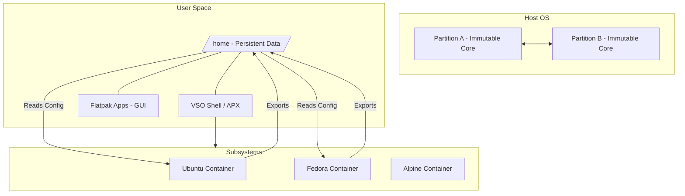

I've been keeping an eye on Vanilla OS for quite a while, but almost all the official documentation was still focused on version 1. Back then, they were planning for the big v1 to v2 upgrade, so I waited. Since I visit my parents once a year, I need a stable, low-maintenance operating system that can be continuously upgraded so I can do some light work during my visits. The last thing I want to do is spend three days fixing my operating system updates and miss out on all the time with family. Today, while on vacation, I set up Hyper-V on my parents' Windows desktop and decided to finally take Vanilla OS 2 (Orchid) for a spin.

What makes Vanilla OS interesting is its design philosophy: it promises an immutable, stable core while giving you the freedom to install software from virtually any Linux distribution. 

<!--more-->

Let's take a closer look at how it works under the hood and some of the rough edges I encountered during my experiment.

## The immutable core and A/B updates

Vanilla OS uses an A/B partition system for atomic updates, very much like how a Chromebook or Android phone updates itself. It relies on a utility called ABRoot. 

So what's happening here: when the system updates, it downloads the changes to partition B while you are still running on partition A. Once you reboot, it simply switches you over to partition B. If the update is broken or the boot fails, you can easily revert to the old OS on partition A.

I got my first experience with the ABRoot system when I needed to install Traditional Chinese input methods. `ibus-chewing` (a bopomofo input method) needs to be installed on the host. To do this, I had to run `abroot pkg add ibus-chewing` and then `abroot pkg apply`. The system then built the new B image with the package included. I had to reboot to switch to that new image to start using it, which is a very cool approach to system modification! (See their [documentation](https://docs.vanillaos.org/handbook/en/install-input-method-editor) for more details).

Because the core OS is completely read-only, Vanilla OS can't handle apps the traditional way. You can't just run `sudo apt install` to modify the host system. Instead, it completely separates the immutable system layers from your personal files and applications using sandboxing and containerization.

*(Disclaimer: This is my limited understanding from a quick read of the documentation. Please contact me if anything is wrong.)*

I was initially confused by the many package management options on Vanilla OS, but this is my mental model now:

| Layer / Mechanism | Target Software Type | How it Works under the Hood |
| -- | -- | -- |
| 1. ABRoot (Host) | Deep system services, drivers, input methods (iBus), display managers | Atomic updates on an immutable root. Modifies the underlying OS safely via A/B partition swaps on reboot. |
| 2. Flatpak | Graphical desktop applications (browsers, Slack, media players) | Containerized desktop apps running directly on top of the host with sandboxed permissions. |
| 3. VSO shell CLI (apt) | CLI tools, language runtimes (Node, Python, Go), build utilities | Runs inside lightweight OCI containers (using Podman) without polluting or touching host system files. |
| 4. Distro Subsystems | Arch/Fedora/Alpine specific packages | Swapping container backends under apx when Debian/Ubuntu packages are out of date or missing. |

## How user data is handled

Your personal files, configurations, and documents are completely decoupled from the system updates. 

All your data is stored in a dedicated `/home` partition. When partition A swaps to partition B during an update, the `/home` directory is simply remounted to the new partition. Your files never move, change, or risk deletion.

## How user apps are handled

Vanilla OS utilizes a "rootless by default" design. Apps are managed through two main channels:

### 1. Desktop apps (via Flatpak)
For everyday graphical apps—like browsers, office suites, or games—Vanilla OS relies on Flatpak. These are sandboxed and installed entirely inside the user space, leaving the core OS untouched. Out of the box, you just use the GNOME Software center to search for and install apps from Flathub.

### 2. Command line & distro apps (via APX and VSO)
This is the really cool part. If you need development tools, terminal utilities, or traditional packages, Vanilla OS uses a custom subsystem manager called APX (which was built alongside the creator of Distrobox).

When you open the terminal emulator (called Black Box), you are actually inside a containerized shell controlled by the Vanilla System Operator (VSO). It's not so obvious that the VSO shell (which you use to create other subsystems) itself is a Debian container. Because V2 is based on Debian, it has `apt`. If you want to quickly install something that is available on Debian/Ubuntu, you don't need to open an Ubuntu subsystem—you can directly run `sudo apt install ...` in the VSO shell. These packages will be installed in the VSO shell container and available there, not directly installed on the host operating system.

Through APX, you can spin up managed containers (called subsystems) of Ubuntu, Fedora, Arch Linux, or Alpine Linux. You can install Ubuntu packages in the Ubuntu container, Fedora packages in the Fedora container, and so on. The underlying technology powering this is Distrobox.

If you are a developer, you can also create custom subsystems with a particular distribution and a specific set of packages for your development environment. This allows you to have a clean, separated environment for different projects, which might come in handy if you are doing a lot of AI work where dependencies can get messy.

What's impressive is the native integration. Even though these apps live in a hidden container, APX seamlessly "exports" them. They will show up normally in your app launcher menu, have access to your files in `/home`, and function exactly like native desktop apps. If you break an application or mess up a container configuration, you can simply reset the APX container environment without any risk of damaging your operating system or losing your personal data.

## Caveats and rough edges

The idea is very cool, but in my experience, it still has some caveats.

### The installer needs internet
The installer requires an active internet connection to pull container images for the base system. In my Hyper-V setup without WiFi hardware, it didn't give me a network settings page, and I had to spend some time wrestling with Hyper-V virtual networking to get the ethernet connection working before I could proceed. An offline install mode would be a huge improvement here.

### The first boot is confusing
Once installed, the system reboots and drops you into a GNOME Display Manager (GDM) login screen featuring Debian branding. It creates a user called `vanilla`, but the installer never asked me to set up a password. I had to Google around to find out that the default password is also `vanilla`. Only after logging into the GNOME environment does the actual setup wizard launch to ask for your username and password. This could definitely be more obvious and streamlined.

### APX subsystems can be buggy
I spent some time trying to understand how APX works. The way I see it, subsystems are essentially containers created with a base OS and a "stack" (which defines the packages installed). This is perfect if you want to create an isolated software development environment with specific tools preinstalled.

However, when I tried creating an Ubuntu subsystem (from both the GUI and CLI), it showed a success message but the subsystem was missing. It turns out this is a known bug ([Issue #499](https://github.com/Vanilla-OS/apx/issues/499)) that seems to mainly affect Ubuntu. Alpine and Fedora subsystems worked fine for me. Also, there is no clearly documented way to update APX itself if you run into bugs.

### Spotty documentation
The team has done a respectable amount of work building all kinds of tools needed to build and run an operating system. But that means almost everything in the documentation mentions tool names you've never heard of, and you have to spend a lot of time trying to understand what each tool does.

Most of the official documentation is a mix of v1 and v2. Information for v2 is scattered across blogs, GitHub issues, and Discord. I tried using an AI to help me navigate the CLI, but it kept hallucinating non-existent APX subcommands. Because of its niche, the documentation is not well ingested into AI search engines and agents, causing hallucinations. Also, since it's based on familiar distributions like Debian, Ubuntu, or Fedora, AI would keep suggesting ways of doing things in traditional distributions, which do not work in this unique immutable design. (Side note: [this article from linux-desktop.net](https://linux-desktop.net/en/test/vanilla-os-2-orchid-tested/) was nicely written and really helped me build a good mental model of the system).

## Looking forward

Vanilla OS 2 Orchid is based on Debian Sid + vanilla GNOME. I usually prefer Sway, but setting it up here seemed like rocket science, so I gave GNOME a pass. Surprisingly, it runs smoother in my VM than Ubuntu's modified GNOME.

There are rumors that Vanilla OS 3 is coming soon. Based on discussions in their Discord, they are mostly waiting for Distrobox v2 changes to stabilize. The good news is that there will be an upgrade path from v2 to v3, which will hopefully smooth out many of these rough edges.

## Conclusion

The combination of a stable core and the ability to install software from any distro attracts me the most. I think it's a much better alternative to Nix. Nix tries to solve a similar problem, but installing software often feels like surgically stitching together a Frankenstein's monster.

Vanilla OS 2 runs completely fine in a Hyper-V VM on my mini PC with an Intel N150 and 8 GB of allocated virtual memory, which is pretty decent considering how many containers are flying around under the hood. I'm excited to see how it runs on restricted hardware—ARM64 support seems to be on the horizon, and if it can run on a Raspberry Pi, that would be amazing.

**Verdict:** Once the tooling stabilizes and this becomes more mainstream, I can see this operating system becoming a stable foundation for day-to-day desktop use. Nowadays, I've stopped distro-hopping and mostly stay on Ubuntu because most software has at least an Ubuntu version due to its popularity. However, Ubuntu's upgrade model makes it very difficult for me to use long-term, as I have to do a dangerous LTS upgrade every few years. Vanilla OS solves this perfectly.
